**UNIVERSIDADE FEDERAL DE ALFENAS**  
**INSTITUTO DE CIÊNCIAS EXATAS**  
**DEPARTAMENTO DE CIÊNCIA DA COMPUTAÇÃO**  
**BACHARELADO EM CIÊNCIA DA COMPUTAÇÃO**

<br><br><br><br><br><br>

**RAFAEL SILVA FORTUNA**

<br><br><br><br><br><br><br><br>

# TESTES DE USABILIDADE DO SOFTWARE DE GESTÃO AGRÍCOLA SMARTPLANTIO

<br><br><br><br><br><br><br><br><br><br>

**Trabalho de Conclusão de Curso apresentado ao Instituto de Ciências Exatas da Universidade Federal de Alfenas como requisito parcial à obtenção do título de Bacharel em Ciência da Computação.**

**Orientador: Prof. Dr. Paulo Alexandre Bressan**

<br><br><br><br><br><br>

**Alfenas, MG**  
**2026**

---

## RESUMO

A agricultura brasileira enfrenta um abismo tecnológico significativo entre grandes corporações do agronegócio e pequenos produtores rurais. Segundo o Censo Agropecuário de 2017, mais de 77% dos estabelecimentos rurais brasileiros são classificados como agricultura familiar, segmento historicamente subatendido por ferramentas digitais de gestão. O Smart Plantio, desenvolvido originalmente por Lage (2025), é uma plataforma web projetada para auxiliar a gestão de propriedades rurais de pequeno porte, centralizando informações financeiras, de safras e de custos em uma interface digital acessível. Este trabalho de conclusão de curso teve como objetivo avaliar a usabilidade dessa plataforma através de uma metodologia científica rigorosa, fundamentada nos princípios da área de Interação Humano-Computador (IHC). Para tanto, foi estruturado um processo experimental em duas rodadas de testes de usabilidade com seis participantes de perfis distintos (leigos, agricultores e técnicos), aplicando-se o protocolo Think-Aloud para captura de verbalizações e o registro sistemático de métricas de efetividade, eficiência e satisfação conforme estabelecido pela norma ISO/IEC 9241-11. A primeira rodada de testes, realizada em maio de 2026, identificou onze problemas críticos de usabilidade, incluindo falhas funcionais catastróficas que impediam a conclusão de tarefas essenciais, resultando em um Net Promoter Score (NPS) de −83,3 pontos. Com base nesses achados, foram implementadas intervenções técnicas priorizadas segundo a escala de severidade de Nielsen, envolvendo correções no backend (Node.js/Express), frontend (React/Material UI) e na arquitetura de dados (MySQL/Sequelize), totalizando 47 commits documentados. A segunda rodada de testes, conduzida em junho de 2026 com os mesmos participantes, validou empiricamente a eficácia das melhorias implementadas: o NPS evoluiu para +33,3 (melhoria de 116,6 pontos percentuais), o tempo médio por tarefa reduziu 27,6%, a taxa de sucesso alcançou 100%, os erros diminuíram 87,5%, e a satisfação aumentou 67,9%. Os resultados evidenciam a importância crítica da validação empírica com usuários reais para a detecção de barreiras de usabilidade que não seriam identificadas em testes puramente técnicos, contribuindo para a literatura de IHC aplicada a sistemas de gestão agrícola e demonstrando que investimento direcionado em usabilidade produz retornos mensuráveis e substanciais na aceitação do usuário.

**Palavras-chave:** Usabilidade. Interação Humano-Computador. Gestão Agrícola. Agricultura Familiar. Testes com Usuários.

---

## ABSTRACT

Brazilian agriculture faces a significant technological gap between large agribusiness corporations and small rural producers. According to the 2017 Agricultural Census, more than 77% of Brazilian rural establishments are classified as family farming, a segment historically underserved by digital management tools. Smart Plantio, originally developed by Lage (2025), is a web platform designed to assist the management of small-scale rural properties by centralizing financial, crop, and cost information in an accessible digital interface. This undergraduate thesis aimed to evaluate the usability of this platform through a rigorous scientific methodology grounded in the principles of Human-Computer Interaction (HCI). To this end, an experimental process was structured in two rounds of usability testing with six participants from different profiles (laypeople, farmers, and technical users), applying the Think-Aloud protocol to capture verbalizations and the systematic recording of effectiveness, efficiency, and satisfaction metrics as established by the ISO/IEC 9241-11 standard. The first round of tests, conducted in May 2026, identified eleven critical usability problems, including catastrophic functional failures that prevented the completion of essential tasks, resulting in a Net Promoter Score (NPS) of −83.3 points. Based on these findings, technical interventions were implemented prioritized according to Nielsen's severity scale, involving corrections in the backend (Node.js/Express), frontend (React/Material UI), and data architecture (MySQL/Sequelize), totaling 47 documented commits. The second round of testing, conducted in June 2026 with the same participants, empirically validated the effectiveness of the implemented improvements: the NPS evolved to +33.3 (improvement of 116.6 percentage points), average time per task was reduced by 27.6%, success rate reached 100%, errors decreased by 87.5%, and satisfaction increased by 67.9%. The results highlight the critical importance of empirical validation with real users for detecting usability barriers that would not be identified in purely technical tests, contributing to the HCI literature applied to agricultural management systems and demonstrating that targeted investment in usability produces measurable and substantial returns in user acceptance.

**Keywords:** Usability. Human-Computer Interaction. Agricultural Management. Family Farming. User Testing.

---

## LISTA DE FIGURAS

Figura 1 — Comparação de tempo médio por tarefa (Rodada 1 vs. Rodada 2) ...................... XX  
Figura 2 — Evolução do Net Promoter Score (NPS) ......................................................... XX  
Figura 3 — Problema P-01: Bug catastrófico na edição de talhões .................................. XX  
Figura 4 — Problema P-02: Erro HTTP 500 na renderização de gráficos .......................... XX  
Figura 5 — Problema P-03: Botão de edição difícil de localizar .................................... XX  
Figura 6 — Problema P-04: Ausência de botão "Voltar" em formulários .......................... XX  
Figura 7 — Problema P-07: Ausência de indicador de carregamento ............................... XX  
Código 1 — Correção do bug catastrófico P-01 (edição de talhões) .............................. XX  
Código 2 — Implementação de indicadores de carregamento (P-07) ................................. XX  
Código 3 — Configuração de CORS e porta dinâmica para deploy .................................... XX

---

## LISTA DE TABELAS

Tabela 1 — Inspeção técnica conduzida pelo desenvolvedor (13/05/2026) ........................ XX  
Tabela 2 — Perfil dos participantes da Rodada 1 ............................................................. XX  
Tabela 3 — Métricas de desempenho por tarefa (Rodada 1) ............................................. XX  
Tabela 4 — Problemas de usabilidade identificados na Rodada 1 ..................................... XX  
Tabela 5 — Avaliação NPS individual (Rodada 1) ........................................................... XX  
Tabela 6 — Mapeamento de problemas e intervenções técnicas ....................................... XX  
Tabela 7 — Métricas de desempenho por tarefa (Rodada 2) ............................................. XX  
Tabela 8 — Avaliação NPS individual (Rodada 2) ........................................................... XX  
Tabela 9 — Comparação consolidada Rodada 1 vs. Rodada 2 .......................................... XX

---

## SUMÁRIO

1. [INTRODUÇÃO](#1-introdução) ................................................................................. XX  
2. [OBJETIVOS](#2-objetivos) ....................................................................................... XX  
   2.1. Objetivo Geral ..................................................................................................... XX  
   2.2. Objetivos Específicos .......................................................................................... XX  
3. [JUSTIFICATIVA](#3-justificativa) ............................................................................ XX  
4. [REFERENCIAL TEÓRICO](#4-referencial-teórico) ................................................. XX  
   4.1. Gestão Agrícola e o Pequeno Produtor ................................................................ XX  
   4.2. O Sistema Smart Plantio ...................................................................................... XX  
      4.2.1. Histórico e Desenvolvimento Original .......................................................... XX  
      4.2.2. Arquitetura de Sistemas com Node.js e Express .......................................... XX  
      4.2.3. Desenvolvimento de Interfaces Reativas com React e Vite ........................... XX  
      4.2.4. Persistência de Dados com MySQL e Sequelize .......................................... XX  
   4.3. Testes de Usabilidade e Interação Humano-Computador ...................................... XX  
      4.3.1. Definição de Usabilidade e Atributos de Avaliação ...................................... XX  
      4.3.2. Heurísticas de Nielsen para Avaliação de Interfaces .................................... XX  
      4.3.3. Classificação de Severidade de Problemas .................................................. XX  
      4.3.4. Protocolo Think-Aloud ................................................................................ XX  
      4.3.5. Escalas de Medição e Satisfação ................................................................. XX  
      4.3.6. Amostragem em Testes de Usabilidade ....................................................... XX  
      4.3.7. Usabilidade versus Aplicabilidade ............................................................... XX  
5. [METODOLOGIA](#5-metodologia) ........................................................................... XX  
   5.1. Classificação da Pesquisa .................................................................................... XX  
   5.2. Design Experimental ............................................................................................ XX  
   5.3. População e Amostra ........................................................................................... XX  
   5.4. Instrumentos de Coleta de Dados ........................................................................ XX  
   5.5. Procedimentos de Teste ....................................................................................... XX  
   5.6. Análise de Dados ................................................................................................. XX  
6. [RESULTADOS E DISCUSSÃO](#6-resultados-e-discussão) ..................................... XX  
   6.1. Avaliação Técnica Preliminar — Inspeção do Desenvolvedor .............................. XX  
   6.2. Rodada 1 — Linha de Base .................................................................................. XX  
      6.2.1. Métricas Quantitativas — Desempenho por Tarefa ...................................... XX  
      6.2.2. Análise Qualitativa — Problemas Identificados ........................................... XX  
      6.2.3. Avaliação de Satisfação — Net Promoter Score (NPS) ................................ XX  
   6.3. Intervenções Técnicas Realizadas ........................................................................ XX  
   6.4. Rodada 2 — Pós-teste .......................................................................................... XX  
   6.5. Análise Comparativa entre Rodadas .................................................................... XX  
   6.6. Discussão dos Resultados .................................................................................... XX  
7. [CONCLUSÃO](#7-conclusão) .................................................................................... XX  
[REFERÊNCIAS](#referências) ...................................................................................... XX  
[APÊNDICES](#apêndices) ............................................................................................. XX  
   APÊNDICE A — Guião de Tarefas para Testes de Usabilidade ..................................... XX  
   APÊNDICE B — Questionário de Satisfação e Escalas de Medição ............................... XX

---

# 1. INTRODUÇÃO

A agricultura brasileira desempenha um papel fundamental e estratégico na economia nacional, sendo responsável por uma parcela expressiva do Produto Interno Bruto (PIB) do país e pela sustentação de inúmeras cadeias produtivas que vão desde a produção de alimentos até a exportação de commodities agrícolas (IBGE, 2019). Segundo dados do Instituto Brasileiro de Geografia e Estatística (IBGE), o setor agropecuário representou aproximadamente 27% do PIB brasileiro em 2023, quando considerados os efeitos diretos e indiretos do agronegócio na economia (IBGE, 2019). Essa relevância econômica é acompanhada por uma característica marcante do campo brasileiro: a expressiva presença da agricultura familiar.

De acordo com o Censo Agropecuário de 2017, mais de 77% dos estabelecimentos rurais brasileiros são classificados como agricultura familiar, totalizando aproximadamente 3,9 milhões de propriedades (IBGE, 2019). Esses pequenos produtores são responsáveis por cerca de 23% do valor total da produção agropecuária nacional e desempenham um papel crucial na segurança alimentar do país, produzindo a maior parte dos alimentos que chegam à mesa dos brasileiros, como feijão, mandioca, leite e hortaliças (EMBRAPA, 2018). Apesar dessa importância socioeconômica inegável, existe um abismo tecnológico nítido e preocupante entre as grandes corporações do agronegócio e o pequeno produtor rural (EMBRAPA, 2018).

Enquanto o grande latifúndio tem acesso a tecnologias avançadas de agricultura de precisão, incluindo monitoramento via satélite, drones, sensores de solo, análise de dados em tempo real por meio de sistemas de Business Intelligence (BI) e até mesmo a utilização de inteligência artificial para previsão de safras, o pequeno agricultor muitas vezes carece de ferramentas básicas e acessíveis para organizar seus custos de produção, planejar suas safras de forma estratégica e entender a real rentabilidade de sua terra (IBGE, 2019; EMBRAPA, 2018). Essa disparidade no acesso à tecnologia cria uma desvantagem competitiva significativa para os pequenos produtores, que enfrentam dificuldades crescentes para se manterem viáveis economicamente num mercado cada vez mais competitivo e globalizado.

A gestão de uma propriedade rural, independentemente de seu porte, envolve uma complexidade considerável e a administração de múltiplas variáveis que vão muito além das atividades operacionais de plantio e colheita (IBGE, 2019). O controle eficiente de insumos mantidos em estoque, a divisão estratégica da terra em glebas ou talhões com diferentes culturas e rotações, o registro detalhado de custos fixos (como depreciação de maquinários e benfeitorias) e variáveis (como sementes, fertilizantes, defensivos agrícolas e mão de obra), e o acompanhamento minucioso do ciclo fenológico de cada safra são tarefas que, quando realizadas de forma manual ou por meio de anotações em cadernos, tornam-se extremamente suscetíveis a erros humanos, omissões de dados e perda de informações críticas ao longo do tempo (IBGE, 2019; SEBRAE, 2020).

Essa falta de estruturação adequada dos dados produtivos e financeiros impede que o produtor tome decisões estratégicas fundamentadas em informações concretas e confiáveis. Questões essenciais para a gestão do negócio agrícola, como identificar o momento ideal para a compra antecipada de insumos visando aproveitar oportunidades de preços mais baixos, determinar quais culturas oferecem o melhor retorno sobre o investimento (ROI) em cada ciclo produtivo, calcular com precisão o custo unitário de produção por hectare ou por tonelada colhida, e planejar adequadamente o fluxo de caixa para evitar descasamentos financeiros, ficam prejudicadas pela ausência de um sistema organizado de registro e análise de dados (EMBRAPA, 2018; SEBRAE, 2020).

Neste cenário de necessidades tecnológicas crescentes e recursos limitados, o sistema **Smart Plantio** apresenta-se como uma solução promissora e acessível. Desenvolvido originalmente por Lage (2025) como trabalho de conclusão de curso na Universidade Federal de Alfenas (UNIFAL), o Smart Plantio é uma plataforma web de gestão agrícola especificamente projetada para atender às demandas e limitações do pequeno produtor rural brasileiro. O sistema foi concebido com o objetivo central de transformar o cotidiano operacional do produtor em um processo orientado por dados, fornecendo ferramentas digitais que centralizam todas as etapas da produção agrícola, desde o mapeamento inicial das propriedades e a divisão em talhões produtivos até a análise financeira detalhada através de painéis visuais de indicadores (dashboards) intuitivos (LAGE, 2025).

A proposta fundamental do Smart Plantio é fornecer ao usuário uma visão simultaneamente macro e micro do seu negócio agrícola, permitindo que ele visualize de forma clara, objetiva e intuitiva tanto a saúde financeira global de sua produção quanto os detalhes operacionais de cada safra individual. Para isso, o sistema oferece funcionalidades integradas de cadastro de propriedades e talhões, registro de safras com informações sobre culturas, datas de plantio e colheita, lançamento detalhado de custos classificados por categorias (insumos, mão de obra, maquinário, etc.), controle de estoque de insumos com alertas de níveis mínimos, e geração automática de relatórios e gráficos financeiros que sintetizam informações complexas em visualizações acessíveis (LAGE, 2025).

A arquitetura técnica do Smart Plantio fundamenta-se em tecnologias web modernas e consolidadas no mercado de desenvolvimento de software. O backend da aplicação utiliza o ambiente de execução Node.js combinado com o framework minimalista Express, proporcionando uma camada de serviços REST (Representational State Transfer) eficiente e escalável para a comunicação com o frontend. O frontend, por sua vez, foi desenvolvido utilizando a biblioteca React, que permite a construção de interfaces de usuário reativas e componentizadas, aliada à ferramenta de build Vite para otimização do processo de desenvolvimento e empacotamento final. A camada de persistência de dados utiliza o sistema gerenciador de banco de dados relacional MySQL, integrado ao backend através do ORM (Object-Relational Mapping) Sequelize, que facilita a manipulação de dados e garante a segurança contra vulnerabilidades como SQL Injection (LAGE, 2025).

Este trabalho de conclusão de curso, também vinculado à Universidade Federal de Alfenas (UNIFAL) e orientado pelo mesmo professor que orientou o desenvolvimento original do sistema (Prof. Dr. Paulo Alexandre Bressan), parte da plataforma Smart Plantio já existente e operacional, mas propõe um foco diferenciado e complementar ao trabalho original de Lage (2025). Enquanto o trabalho de Lage concentrou-se no desenvolvimento técnico do sistema, na implementação de funcionalidades e na arquitetura de software, o presente trabalho dedica-se especificamente à avaliação científica e rigorosa da **usabilidade** da plataforma, reconhecendo que a facilidade de uso e a qualidade da experiência do usuário (User Experience - UX) são tão importantes quanto a solidez técnica e funcional do sistema, especialmente quando o público-alvo possui características específicas como diferentes níveis de letramento digital (CYBIS; BETIOL; FAUST, 2015; NIELSEN, 1993).

A abordagem metodológica adotada neste trabalho fundamenta-se nos princípios consolidados da área de Interação Humano-Computador (IHC), que estabelece que a qualidade de um sistema interativo deve ser avaliada não apenas por métricas técnicas de performance ou pela completude de suas funcionalidades, mas principalmente pela capacidade do sistema de permitir que seus usuários reais atinjam seus objetivos de forma efetiva (completando as tarefas com sucesso), eficiente (com o mínimo de esforço e tempo) e satisfatória (com conforto e percepção positiva), conforme estabelecido pela norma internacional ISO/IEC 9241-11 (ISO/IEC, 2018).

A pesquisa foi estruturada em dois ciclos experimentais distintos e complementares de testes de usabilidade com usuários reais. A primeira rodada de testes, realizada em maio de 2026 com seis participantes representando diferentes perfis de usuários (leigos em tecnologia, agricultores do público-alvo e técnicos com alta literacia digital), teve como objetivo primário detectar e catalogar as principais barreiras de usabilidade, falhas de interface e problemas de experiência do usuário presentes na versão original do sistema. Essa etapa inicial permitiu estabelecer uma linha de base (baseline) mensurável do estado de usabilidade do sistema através de métricas quantitativas como tempo de execução de tarefas, taxa de conclusão com sucesso, número de erros cometidos e avaliações subjetivas de satisfação, além de dados qualitativos coletados através do protocolo Think-Aloud (pensar em voz alta), que captura as verbalizações espontâneas dos participantes durante a interação com o sistema (NIELSEN; LANDAUER, 1993; ERICSSON; SIMON, 1993).

Após a análise detalhada dos dados coletados na primeira rodada, foi conduzida uma etapa intensiva de intervenções técnicas no código-fonte do sistema, priorizando as correções segundo a escala de severidade proposta por Nielsen (1994), que classifica os problemas de usabilidade em quatro níveis: cosméticos (baixa prioridade), menores (média prioridade), graves (alta prioridade) e catastróficos (prioridade máxima, impedem o uso do sistema). Essas correções envolveram modificações tanto no backend (correção de endpoints de API, otimização de consultas ao banco de dados, implementação de tratamento de erros) quanto no frontend (melhoria de componentes de interface, tradução completa para português, adição de indicadores visuais de feedback, ajustes de responsividade para dispositivos móveis), totalizando 47 commits documentados no sistema de controle de versão Git ao longo de três semanas de desenvolvimento (NIELSEN, 1994).

A segunda rodada de testes, conduzida com os mesmos seis participantes da primeira rodada utilizando exatamente o mesmo protocolo de tarefas, visa validar empiricamente a eficácia das intervenções técnicas realizadas através da comparação direta e estatística das métricas de desempenho entre as duas rodadas. Essa abordagem metodológica de pré-teste — intervenção — pós-teste com grupo único permite quantificar objetivamente as melhorias obtidas e identificar se ainda persistem barreiras de usabilidade que exigem atenção adicional (PRODANOV; FREITAS, 2013).

Dessa forma, o presente trabalho busca entregar não apenas um software funcional do ponto de vista técnico, mas uma ferramenta que tenha sido testada, otimizada e validada cientificamente para atender às necessidades reais e às limitações do homem do campo brasileiro, contribuindo assim para a redução do abismo tecnológico que ainda separa a agricultura familiar das grandes corporações do agronegócio. Além disso, do ponto de vista acadêmico, a pesquisa contribui para o corpo de conhecimento da área de Interação Humano-Computador ao aplicar métodos consolidados de avaliação de usabilidade em um domínio específico e socialmente relevante, gerando evidências empíricas sobre como princípios de design de interfaces comportam-se diante das necessidades de um público com características particulares de uso e contexto operacional.

---

# 2. OBJETIVOS

## 2.1. Objetivo Geral

Avaliar a usabilidade do sistema web Smart Plantio, desenvolvido para gestão de propriedades rurais de pequeno porte, através de testes empíricos com usuários reais, identificando problemas críticos de interface e experiência do usuário, implementando melhorias fundamentadas na literatura de Interação Humano-Computador e validando a eficácia dessas intervenções por meio de análise comparativa quantitativa e qualitativa.

## 2.2. Objetivos Específicos

a) Conduzir uma rodada inicial de testes de usabilidade com seis participantes de perfis diversos (leigos, agricultores e técnicos), aplicando o protocolo Think-Aloud e mensurando métricas de efetividade, eficiência e satisfação conforme a norma ISO/IEC 9241-11, estabelecendo assim uma linha de base do estado de usabilidade do sistema.

b) Identificar, catalogar e classificar os problemas de usabilidade encontrados segundo a escala de severidade de Nielsen, distinguindo entre problemas cosméticos, menores, graves e catastróficos, e documentando suas manifestações através de dados quantitativos (tempos, erros, taxas de sucesso) e qualitativos (verbalizações dos participantes).

c) Implementar intervenções técnicas priorizadas no código-fonte do sistema (backend e frontend), visando corrigir os problemas identificados e melhorar a experiência do usuário, documentando todas as modificações realizadas através de controle de versão e justificando cada decisão de design com base em princípios teóricos de IHC.

d) Conduzir uma segunda rodada de testes de usabilidade com os mesmos participantes e protocolo de tarefas, permitindo a comparação direta das métricas de desempenho antes e depois das intervenções técnicas.

e) Analisar comparativamente os dados das duas rodadas de testes, calculando as variações percentuais nas métricas de tempo, erros, taxa de sucesso e satisfação, e validando estatisticamente a eficácia das melhorias implementadas.

f) Contribuir para a literatura acadêmica de Interação Humano-Computador aplicada a sistemas de gestão agrícola, documentando a metodologia empregada, os achados empíricos e as lições aprendidas ao longo do processo de avaliação e melhoria iterativa do sistema.

---

# 3. JUSTIFICATIVA

A relevância deste projeto fundamenta-se em três pilares interdependentes e complementares: o impacto socioeconômico da agricultura familiar brasileira e a necessidade de ferramentas tecnológicas acessíveis para esse segmento; a importância da eficiência operacional na gestão de propriedades rurais de pequeno porte; e a contribuição técnico-científica para a área de Interação Humano-Computador (IHC) aplicada a domínios específicos e socialmente relevantes.

## 3.1. Pilar Socioeconômico: Empoderamento do Pequeno Produtor

No âmbito socioeconômico, a falta de controle sistemático e organizado sobre os custos de produção agrícola é reconhecida como um dos principais fatores que levam ao endividamento progressivo, à perda de competitividade e, em última instância, à eventual desistência da atividade rural por parte de pequenos produtores (IBGE, 2019). Estudos conduzidos pelo SEBRAE (2020) demonstram que uma parcela significativa dos agricultores familiares brasileiros não possui conhecimento preciso sobre o custo real de produção de suas safras, operando muitas vezes com base em estimativas imprecisas ou simplesmente na intuição acumulada ao longo dos anos.

Sem uma ferramenta tecnológica adequada que consolide de forma sistemática e confiável todos os gastos envolvidos na produção — incluindo custos com insumos agrícolas (sementes, fertilizantes, defensivos), mão de obra (própria e contratada), manutenção e depreciação de equipamentos, despesas com energia elétrica e combustíveis, entre outros — o preço final de venda da colheita muitas vezes não cobre adequadamente o custo operacional real da safra. Isso resulta em prejuízos "invisíveis" que se acumulam silenciosamente ao longo dos ciclos produtivos, corroendo gradualmente o capital de giro da propriedade e levando a uma situação financeira insustentável a médio e longo prazo (SEBRAE, 2020).

O Smart Plantio, ao oferecer funcionalidades integradas de registro detalhado de custos, categorização automática de despesas, relatórios consolidados por safra e por talhão, e dashboards visuais de análise financeira com gráficos intuitivos de composição de custos e projeção de rentabilidade, proporciona ao produtor rural o empoderamento necessário para gerir sua propriedade de forma profissional, com a mesma seriedade e rigor gerencial que uma empresa urbana aplica em sua gestão financeira (LAGE, 2025). Essa transformação de mentalidade — do agricultor que planta "no sentimento" para o gestor rural que toma decisões baseadas em indicadores quantitativos concretos e confiáveis — é fundamental para a sustentabilidade econômica da agricultura familiar brasileira e para a segurança alimentar do país (EMBRAPA, 2018).

Adicionalmente, o acesso a informações financeiras organizadas e a capacidade de demonstrar com precisão os custos de produção e a rentabilidade das safras pode facilitar significativamente o acesso do pequeno produtor a linhas de crédito rural, financiamentos e programas governamentais de apoio à agricultura familiar, que frequentemente exigem comprovação documental de viabilidade econômica e capacidade de pagamento. Nesse sentido, o Smart Plantio atua não apenas como uma ferramenta de gestão interna, mas também como um instrumento de profissionalização e inclusão financeira do pequeno produtor rural.

## 3.2. Pilar Operacional: Digitalização e Eficiência na Gestão

Do ponto de vista operacional, a transição do registro manual de dados — comumente realizado em cadernos de anotações, blocos de papel, planilhas isoladas em computadores pessoais ou até mesmo confiado exclusivamente à memória do produtor — para um sistema digital integrado, acessível via web de qualquer dispositivo conectado à internet, mitiga uma série de riscos graves e frequentemente subestimados de perda de informação e erros de cálculo que podem comprometer seriamente a gestão da propriedade rural (EMBRAPA, 2018).

Cadernos e anotações em papel estão sujeitos a danos físicos (umidade, deterioração, extravios), dificultam a recuperação de informações históricas quando necessário, não permitem consolidação automática de dados para análise, e são propensos a erros de transcrição e cálculo manual. Planilhas eletrônicas isoladas, embora representem um avanço em relação ao papel, frequentemente carecem de integração entre diferentes tipos de informação (propriedades, safras, custos, estoque), dificultam o compartilhamento de dados entre múltiplos usuários, e exigem conhecimento técnico significativo para manutenção e correção de fórmulas complexas (SEBRAE, 2020).

A gestão de estoque integrada ao sistema de lançamento de custos oferecida pelo Smart Plantio evita problemas comuns como a compra redundante de insumos que já estavam disponíveis em quantidade suficiente no estoque (desperdiçando capital de giro), ou a falta inesperada de insumos críticos em momentos essenciais do ciclo produtivo (como fertilizantes no período de adubação ou defensivos durante uma infestação de pragas), otimizando assim o fluxo de caixa da propriedade e garantindo a continuidade das operações agrícolas (LAGE, 2025).

Além disso, a funcionalidade de colaboração via sistema de convites implementada no Smart Plantio permite que a gestão da propriedade seja compartilhada de forma controlada e segura entre diferentes membros da família, parceiros comerciais, agrônomos consultores ou administradores contratados, cada um com níveis de acesso apropriados às suas responsabilidades. Essa capacidade de gestão colaborativa é particularmente importante no contexto da agricultura familiar brasileira, onde frequentemente observa-se a necessidade de profissionalização da sucessão familiar — preparando a nova geração para assumir a gestão da propriedade com ferramentas modernas e processos organizados — e garantindo transparência na administração dos recursos produtivos e financeiros da família (EMBRAPA, 2018).

## 3.3. Pilar Técnico-Científico: Contribuição para a Área de IHC

Sob a ótica acadêmica e técnico-científica, a justificativa central deste trabalho reside no desafio metodológico e científico de projetar, avaliar e otimizar interfaces de usuário que sejam genuinamente utilizáveis por um público que opera em condições específicas e desafiadoras, frequentemente caracterizadas por limitações de letramento digital, acesso intermitente à internet em áreas rurais, uso predominante de dispositivos móveis com telas menores, e contexto de uso que pode envolver distrações ambientais, pressa operacional e condições adversas de iluminação e ergonomia (CYBIS; BETIOL; FAUST, 2015).

O diferencial metodológico e a contribuição científica deste trabalho de conclusão de curso não residem apenas na entrega de funcionalidades técnicas adicionais ao sistema Smart Plantio, mas sim na aplicação rigorosa de uma metodologia científica consolidada de avaliação de usabilidade baseada em testes empíricos com usuários reais, fundamentada em normas internacionais (ISO/IEC 9241-11) e em modelos teóricos reconhecidos da área de Interação Humano-Computador (heurísticas de Nielsen, protocolo Think-Aloud, escalas validadas de satisfação como SUS e NPS) (ISO/IEC, 2018; NIELSEN, 1993; BROOKE, 1996; REICHHELD, 2003).

Este processo investigativo é fundamental para compreender, de forma empiricamente fundamentada e não meramente especulativa, como elementos específicos de interface — tais como a escolha de rótulos e ícones, a organização hierárquica de menus e formulários, o feedback visual fornecido durante operações assíncronas, a responsividade em dispositivos móveis, a tradução adequada de termos técnicos para linguagem acessível ao usuário rural, entre outros aspectos — comportam-se de fato diante das necessidades reais, expectativas cognitivas e modelos mentais dos usuários-alvo do sistema (PREECE; ROGERS; SHARP, 2019).

A literatura acadêmica de Interação Humano-Computador é rica em estudos sobre usabilidade de sistemas corporativos, aplicações de e-commerce, redes sociais e outros domínios amplamente pesquisados, porém apresenta uma lacuna significativa no que se refere a sistemas de gestão agrícola voltados especificamente para pequenos produtores em países em desenvolvimento como o Brasil. Este trabalho contribui para preencher essa lacuna ao gerar evidências empíricas documentadas sobre os desafios específicos de usabilidade nesse domínio, os tipos de problemas mais prevalentes, as intervenções de design mais eficazes, e as métricas de melhoria obtidas através de um processo iterativo de teste-correção-reteste (NIELSEN; LANDAUER, 1993).

Portanto, este projeto justifica-se por oferecer uma solução que integra harmoniosamente a robustez de uma arquitetura de software escalável e tecnicamente sólida — herdada do trabalho original de Lage (2025) — com um compromisso científico explícito e metodologicamente rigoroso com a avaliação e melhoria contínua da experiência do usuário, contribuindo assim para a redução do abismo tecnológico que ainda separa as oportunidades disponíveis no campo da gestão digital das limitações enfrentadas pelo pequeno produtor rural brasileiro.

---

# 4. REFERENCIAL TEÓRICO

O referencial teórico deste trabalho busca estabelecer as bases conceituais, metodológicas e tecnológicas que sustentam tanto a compreensão do domínio do problema — a gestão agrícola de pequenas propriedades rurais no contexto brasileiro — quanto as soluções tecnológicas implementadas no sistema Smart Plantio e os métodos científicos empregados para avaliação de sua usabilidade. A integração harmoniosa dessas três áreas de conhecimento é o que permite a criação de uma ferramenta que seja, simultaneamente, tecnicamente robusta do ponto de vista da engenharia de software, socialmente útil e relevante para o contexto agrícola brasileiro, e metodologicamente validada segundo os princípios da área de Interação Humano-Computador.

## 4.1. Gestão Agrícola e o Pequeno Produtor

A gestão eficiente de uma propriedade rural contemporânea exige que o produtor atue não apenas como um cultivador habilidoso da terra, mas como um gestor estratégico multifacetado, responsável pela administração integrada de recursos financeiros (capital de giro, investimentos, financiamentos), materiais (insumos, equipamentos, infraestrutura) e humanos (mão de obra própria e contratada) (IBGE, 2019). Segundo a Empresa Brasileira de Pesquisa Agropecuária (Embrapa), a agricultura digital e a chamada "Agricultura 4.0" não se resumem ao uso de maquinários pesados e autônomos, drones, sensores de solo ou outras tecnologias de ponta acessíveis apenas às grandes corporações do agronegócio. Essencialmente, essas tendências referem-se ao uso inteligente, estratégico e fundamentado de informações para reduzir as incertezas inerentes ao campo, tais como variações climáticas imprevisíveis, flutuações de mercado, pragas e doenças, e volatilidade nos preços de insumos e produtos (EMBRAPA, 2018).

Para o pequeno produtor rural brasileiro, que opera tipicamente com margens de lucro reduzidas e menor capacidade de absorver prejuízos ou imprevistos financeiros, o principal desafio da gestão não reside necessariamente na ausência de conhecimento técnico agronômico — esse conhecimento frequentemente é transmitido entre gerações e aprimorado através da experiência prática acumulada — mas sim na capacidade de organizar sistematicamente o fluxo de caixa e o controle de insumos de maneira que seja possível prever com antecedência razoável a viabilidade econômica de cada safra antes mesmo do início efetivo do ciclo produtivo (IBGE, 2019; SEBRAE, 2020).

A ausência de uma visão sistêmica, integrada e quantitativamente fundamentada da propriedade rural frequentemente leva a uma confusão perigosa e prejudicial entre o patrimônio familiar pessoal e o capital de giro operacional da atividade produtiva. Essa falta de separação clara entre as finanças domésticas e as finanças do negócio agrícola mascara custos reais de manutenção de equipamentos, depreciação de benfeitorias, investimentos em infraestrutura e outros gastos que, embora nem sempre visíveis no curto prazo, comprometem seriamente a sustentabilidade econômica do negócio no médio e longo prazo (SEBRAE, 2020).

A fragmentação dos dados produtivos e financeiros é identificada como um problema crônico e estrutural nesse setor. Muitas vezes, as informações sobre o custo de sementes, fertilizantes, defensivos agrícolas, corretivos de solo, mão de obra contratada, serviços de maquinário e outros insumos estão dispersas em anotações informais, notas fiscais guardadas sem organização, memórias imprecisas ou simplesmente não registradas de forma alguma. Essa dispersão dificulta enormemente o cálculo do custo unitário por gleba — que é a unidade mínima de gestão territorial da propriedade — ou do custo por tonelada produzida, impedindo análises comparativas entre safras, culturas ou períodos (IBGE, 2019).

A adoção de sistemas de gestão do tipo ERP (Enterprise Resource Planning) simplificados e adaptados à realidade do campo permite que esses dados sejam centralizados em uma única plataforma digital, transformando registros brutos e desconexos em indicadores de desempenho (KPIs - Key Performance Indicators) que auxiliam na tomada de decisões estratégicas. Esses indicadores incluem métricas como custo médio por hectare, rentabilidade por cultura, retorno sobre investimento (ROI), ponto de equilíbrio financeiro, e projeções de fluxo de caixa para os próximos ciclos produtivos. Essas informações são essenciais para a sustentabilidade do negócio agrícola e para a segurança alimentar das famílias rurais a longo prazo (EMBRAPA, 2018; SEBRAE, 2020).

## 4.2. O Sistema Smart Plantio

Esta seção apresenta o sistema Smart Plantio em seus aspectos históricos, funcionais e arquiteturais, contextualizando o desenvolvimento original da plataforma e detalhando as tecnologias empregadas em sua construção.

### 4.2.1. Histórico e Desenvolvimento Original

O sistema Smart Plantio foi originalmente concebido e desenvolvido por Renan Magalhães Lage como trabalho de conclusão do curso de Bacharelado em Ciência da Computação pela Universidade Federal de Alfenas (UNIFAL), sob orientação do Prof. Dr. Paulo Alexandre Bressan, tendo sido apresentado e aprovado em 14 de julho de 2025 (LAGE, 2025). O trabalho de Lage foi intitulado "SmartPlantio: Sistema de Gestão de Safras para Pequenos Produtores" e teve como foco principal o desenvolvimento técnico completo da plataforma, incluindo a concepção da arquitetura de software, a implementação das funcionalidades de gestão de propriedades rurais, o desenvolvimento das interfaces de usuário, a integração com banco de dados, e a implantação (deployment) da aplicação em ambiente de produção.

Segundo Lage (2025), a motivação central para o desenvolvimento do Smart Plantio surgiu da observação de que, embora existissem no mercado algumas soluções voltadas à gestão de propriedades rurais, muitas delas apresentavam características que as tornavam inadequadas ou inacessíveis ao público-alvo da agricultura familiar e de pequeno porte. Essas limitações incluíam: (a) excesso de funcionalidades complexas e desnecessárias para o pequeno produtor, tornando a curva de aprendizado muito íngreme; (b) custos elevados de assinatura mensal ou anual, incompatíveis com o orçamento reduzido típico das pequenas propriedades; (c) interfaces de usuário confusas, sobrecarregadas e pouco intuitivas; e (d) ausência de foco específico nos aspectos de controle financeiro e de custos, que são as necessidades mais urgentes do pequeno produtor.

Diante desse cenário, Lage (2025) propôs o desenvolvimento de um ambiente digital dedicado especificamente ao gerenciamento de safras de pequenas propriedades rurais, com foco especial nos aspectos relacionados aos custos de produção. A aplicação desenvolvida oferece uma interface simplificada e intuitiva para a visualização dos dados coletados, facilita o processo de registro de despesas operacionais, e beneficia não apenas os proprietários, mas também os gestores administrativos e os agrônomos eventualmente envolvidos na consultoria técnica dessas propriedades (LAGE, 2025).

O presente trabalho, desenvolvido por Rafael Silva Fortuna sob orientação do mesmo professor (Prof. Dr. Paulo Alexandre Bressan), parte da plataforma já implementada por Lage (2025) e propõe um foco complementar e igualmente essencial: a avaliação sistemática da usabilidade do sistema através de testes empíricos com usuários reais. Reconhece-se que o desenvolvimento técnico sólido e funcional realizado por Lage constitui a base necessária, mas não suficiente, para garantir que o sistema seja de fato utilizável e adotável pelo público-alvo. Assim, este trabalho contribui com a camada de validação centrada no usuário, identificando barreiras de usabilidade, implementando melhorias baseadas em evidências empíricas, e documentando cientificamente todo o processo de otimização da experiência do usuário.

### 4.2.2. Arquitetura de Sistemas com Node.js e Express

O desenvolvimento de sistemas modernos para a web fundamenta-se no princípio arquitetural de separação de responsabilidades (Separation of Concerns), que preconiza a divisão do software em camadas ou módulos distintos, cada um com responsabilidades bem definidas e interfaces claras de comunicação. Essa abordagem favorece a escalabilidade do sistema (capacidade de crescer em funcionalidades e usuários sem perda significativa de desempenho), a manutenibilidade do código-fonte (facilidade de corrigir bugs e implementar novas funcionalidades), e a testabilidade (possibilidade de testar cada componente de forma isolada) (TILKOV; VINOSKI, 2010).

A arquitetura escolhida para o Smart Plantio reflete essas necessidades e boas práticas da engenharia de software moderna, utilizando um ecossistema baseado na linguagem JavaScript tanto no lado do servidor (backend) quanto no lado do cliente (frontend), o que unifica a linguagem de programação em todas as camadas da aplicação. Essa escolha reduz a fricção cognitiva no desenvolvimento, permite o compartilhamento de código e bibliotecas entre frontend e backend, e facilita a formação de equipes de desenvolvimento full-stack (desenvolvedores capazes de trabalhar em todas as camadas do sistema) (LAGE, 2025).

O backend da aplicação Smart Plantio utiliza o ambiente de execução Node.js, uma plataforma construída sobre o motor JavaScript V8 do navegador Google Chrome, que permite a execução de código JavaScript no lado do servidor, fora do contexto do navegador web. O Node.js destaca-se por seu modelo de entrada/saída (I/O) não bloqueante e orientado a eventos, o que significa que operações demoradas como consultas ao banco de dados, leituras de arquivos ou requisições HTTP para APIs externas não bloqueiam a execução de outras tarefas, permitindo que o servidor processe múltiplas requisições de forma concorrente e eficiente (TILKOV; VINOSKI, 2010).

Essa característica torna o Node.js extremamente eficiente para aplicações web intensivas em dados que realizam múltiplas requisições simultâneas ao banco de dados e precisam gerenciar sessões de múltiplos usuários conectados, garantindo que o sistema permaneça responsivo mesmo sob alta carga de processamento ou picos de acesso. No contexto do Smart Plantio, essa eficiência é especialmente importante quando múltiplos usuários (proprietários, gestores, colaboradores) acessam simultaneamente os dados de suas propriedades, consultam relatórios, geram gráficos e registram custos (LAGE, 2025).

Complementarmente ao Node.js, utiliza-se o framework web Express para o gerenciamento das rotas da API (Application Programming Interface) e para a estruturação da lógica de negócio do backend. O Express é um framework minimalista, não opinativo e altamente flexível que fornece uma camada fina de abstração sobre as funcionalidades nativas do Node.js, facilitando a construção de servidores HTTP e a implementação de serviços web no padrão arquitetural REST (Representational State Transfer) (TILKOV; VINOSKI, 2010).

APIs RESTful, implementadas com Express no Smart Plantio, permitem que o frontend se comunique com o servidor de forma padronizada, utilizando os métodos HTTP convencionais (GET para consultar dados, POST para criar novos recursos, PUT para atualizar recursos existentes, DELETE para remover recursos) e trocando informações no formato JSON (JavaScript Object Notation), que é leve, legível e amplamente suportado. Essa arquitetura de comunicação entre frontend e backend é segura, escalável e facilita a eventual criação de aplicativos móveis nativos (iOS/Android) que consumiriam a mesma API (LAGE, 2025).

A combinação Node.js + Express garante que o Smart Plantio possua uma base técnica sólida e profissional para gerenciar funcionalidades críticas como autenticação de usuários (via OAuth 2.0 com Google), autorização baseada em papéis (proprietários, gestores, colaboradores com diferentes níveis de acesso), validação de dados de entrada, tratamento de erros, e gerenciamento seguro do fluxo de informações entre as diferentes entidades do sistema (propriedades, talhões, safras, custos, estoque) (LAGE, 2025).

### 4.2.3. Desenvolvimento de Interfaces Reativas com React e Vite

No ecossistema de desenvolvimento frontend moderno, a biblioteca React, criada e mantida pela Meta (anteriormente Facebook), destaca-se como uma das soluções mais populares e amplamente adotadas pela indústria de software para a construção de interfaces de usuário interativas e reativas. O React introduz uma abordagem declarativa e baseada em componentes para o desenvolvimento de UIs, em contraste com o modelo tradicional imperativo de manipulação direta do DOM (Document Object Model) através de JavaScript vanilla ou bibliotecas como jQuery (FEDERICO, 2015; BANKS; PORCELLO, 2020).

Ao contrário do modelo tradicional, onde o desenvolvedor precisa escrever código explícito para selecionar elementos do DOM, modificar seus atributos, adicionar ou remover classes CSS, manipular eventos, e gerenciar manualmente o estado da interface — o que pode rapidamente se tornar complexo, propenso a erros e difícil de manter em aplicações grandes —, o React permite que o desenvolvedor descreva como a interface deve aparecer para cada possível estado da aplicação, e a biblioteca se encarrega de atualizar eficientemente o DOM real quando o estado muda (BANKS; PORCELLO, 2020).

Essa eficiência é alcançada através de uma abstração denominada Virtual DOM (DOM Virtual). O Virtual DOM é uma representação leve e em memória da estrutura da interface. Quando o estado de um componente React muda (por exemplo, quando o usuário clica em um botão, preenche um formulário, ou quando dados são recebidos de uma API), o React primeiro atualiza o Virtual DOM, depois compara essa nova versão com a versão anterior através de um algoritmo de diferenciação (diffing algorithm) extremamente otimizado, identifica exatamente quais partes do DOM real precisam ser atualizadas, e aplica apenas essas modificações mínimas necessárias. Esse processo, chamado de reconciliação (reconciliation), garante que a interface permaneça sempre sincronizada com o estado da aplicação, mas evita operações custosas de re-renderização completa, resultando em uma experiência de navegação fluida e responsiva mesmo em aplicações complexas (FEDERICO, 2015; BANKS; PORCELLO, 2020).

A modularização por meio de componentes é um dos pilares fundamentais da arquitetura do Smart Plantio. No paradigma de componentes do React, cada elemento visual e funcional da interface — como os formulários de cadastro de safras, as tabelas de listagem de propriedades e talhões, os gráficos de análise de custos, os cards informativos do dashboard, os modais de confirmação, os menus de navegação, entre outros — é desenvolvido como uma unidade independente, autocontida e reutilizável, encapsulando sua própria estrutura HTML (via JSX), estilização CSS e lógica de comportamento JavaScript (LAGE, 2025).

Essa prática de componentização não apenas facilita enormemente a manutenção do sistema, permitindo que alterações em um módulo específico não afetem inadvertidamente os demais componentes, mas também promove a consistência visual e comportamental em toda a plataforma. Por exemplo, se o botão de ação primária do sistema precisa ter sua cor alterada ou seu comportamento de clique modificado, basta alterar o componente Button uma única vez, e todas as centenas de instâncias desse botão espalhadas pela aplicação herdam automaticamente a modificação (BANKS; PORCELLO, 2020).

Para acelerar ainda mais o desenvolvimento e garantir consistência visual com princípios consolidados de design de interfaces, o Smart Plantio integra a biblioteca Material UI (MUI), que implementa os componentes do Material Design, um sistema de design criado pelo Google e amplamente reconhecido por sua clareza visual, usabilidade e acessibilidade. O Material UI fornece componentes prontos e altamente customizáveis como botões, campos de formulário, tabelas de dados (DataGrid), modais, menus, ícones, tipografia, sistema de grid responsivo, entre muitos outros, permitindo que o desenvolvedor construa interfaces profissionais e esteticamente agradáveis sem precisar implementar cada elemento do zero (LAGE, 2025).

Para a orquestração do ambiente de desenvolvimento e o empacotamento final do projeto frontend, utiliza-se o Vite, uma ferramenta de build de nova geração que representa uma evolução significativa em relação a soluções mais antigas e consolidadas como o Webpack (utilizado pelo Create React App) ou o Parcel. O diferencial técnico do Vite reside em sua abordagem de módulos ES nativos (Native ESM - ES Modules) durante o desenvolvimento (VITE, 2024).

Em ferramentas tradicionais baseadas em Webpack, todo o código-fonte da aplicação precisa ser empacotado (bundled) em um único ou poucos arquivos JavaScript antes que a aplicação possa ser executada no navegador. Em projetos grandes, esse processo de empacotamento inicial pode levar dezenas de segundos ou até minutos, gerando uma experiência frustrante para o desenvolvedor que precisa esperar longos períodos toda vez que inicia o servidor de desenvolvimento ou modifica um arquivo (VITE, 2024).

O Vite adota uma abordagem radicalmente diferente: durante o desenvolvimento, ele não realiza empacotamento completo algum. Em vez disso, o Vite serve os módulos JavaScript sob demanda, aproveitando o suporte nativo dos navegadores modernos para ES Modules. Isso resulta em um tempo de inicialização do servidor de desenvolvimento quase instantâneo (tipicamente menos de 1 segundo, mesmo em projetos muito grandes) e uma experiência de Hot Module Replacement (HMR - substituição de módulos a quente) extremamente veloz, onde mudanças no código são refletidas no navegador em milissegundos, sem precisar recarregar a página inteira ou perder o estado da aplicação (VITE, 2024).

Para o projeto deste trabalho de conclusão de curso, essa escolha tecnológica justifica-se não apenas pela produtividade no desenvolvimento e na implementação das correções identificadas nos testes de usabilidade, mas também pela garantia de uma aplicação final otimizada para carregamentos rápidos em produção. O Vite realiza otimizações avançadas no momento do build de produção, incluindo tree-shaking (remoção de código não utilizado), minificação agressiva, code-splitting automático (divisão do código em múltiplos arquivos menores carregados sob demanda), e pré-carregamento inteligente de recursos. Essas otimizações são cruciais para mitigar um dos problemas identificados nas rodadas iniciais de testes de usabilidade: tempos de carregamento percebidos como lentos pelos usuários, especialmente em conexões de internet rural com velocidades limitadas (LAGE, 2025; VITE, 2024).

### 4.2.4. Persistência de Dados com MySQL e Sequelize

A camada de persistência de dados do Smart Plantio é estruturada sobre o sistema de gerenciamento de banco de dados relacional MySQL, um dos SGBDs (Sistemas Gerenciadores de Banco de Dados) relacionais de código aberto mais populares, maduros e amplamente utilizados em aplicações web de missão crítica ao redor do mundo (SILBERSCHATZ; KORTH; SUDARSHAN, 2012; MILANI, 2011).

Por se tratar de um sistema de gestão que lida com entidades altamente relacionadas entre si — propriedades que possuem múltiplos talhões, talhões que hospedam diversas safras ao longo do tempo, safras que têm inúmeros custos associados de diferentes categorias, usuários que podem ter acesso a múltiplas propriedades através de convites, estoques de insumos vinculados a propriedades específicas, entre outros relacionamentos — a escolha por um modelo relacional garante a integridade referencial dos dados através de constraints de chave estrangeira (foreign keys), a consistência das informações através de transações ACID (Atomicidade, Consistência, Isolamento, Durabilidade), e a capacidade de realizar consultas complexas envolvendo múltiplas tabelas através da linguagem SQL (Structured Query Language) (SILBERSCHATZ; KORTH; SUDARSHAN, 2012).

A integridade referencial, em particular, é fundamental para evitar inconsistências graves no sistema. Por exemplo, se um usuário tenta excluir uma propriedade que ainda possui talhões cadastrados, ou talhões que ainda têm safras ativas, o banco de dados pode impedir essa operação através de restrições configuradas (CASCADE, RESTRICT, SET NULL), protegendo contra perda acidental de dados ou estados inconsistentes onde safras ficam órfãs, sem referência a nenhum talhão ou propriedade (MILANI, 2011).

Para intermediar a comunicação entre o servidor Node.js/Express e o banco de dados MySQL, utiliza-se o Sequelize, um ORM (Object-Relational Mapping - Mapeamento Objeto-Relacional) maduro e amplamente adotado no ecossistema JavaScript/Node.js. O conceito fundamental de um ORM é permitir que o desenvolvedor manipule as tabelas e registros do banco de dados como se fossem objetos nativos da linguagem de programação, abstraindo a necessidade de escrever manualmente consultas SQL complexas para operações rotineiras (MILANI, 2011).

Por exemplo, para criar uma nova safra no banco de dados, ao invés de escrever uma instrução SQL INSERT com todos os campos manualmente montados e interpolados (o que é propenso a erros de sintaxe e vulnerabilidades de segurança como SQL Injection), o desenvolvedor simplesmente cria uma instância do modelo Safra, define seus atributos através de propriedades de objeto JavaScript, e chama um método `.save()` ou `.create()`. O Sequelize automaticamente gera a instrução SQL apropriada, escapa corretamente todos os valores (protegendo contra SQL Injection), executa a query no banco de dados, e retorna o objeto criado com seu ID recém-gerado (LAGE, 2025).

Além de aumentar significativamente a produtividade do desenvolvimento e reduzir a propensão a erros, o Sequelize oferece mecanismos avançados e essenciais para a evolução contínua do schema do banco de dados através de migrations (migrações). Migrations são scripts versionados que descrevem modificações na estrutura do banco de dados (criar novas tabelas, adicionar colunas, modificar tipos de dados, criar índices, etc.). Essa abordagem garante que a estrutura das tabelas de safras, custos, estoque e demais entidades seja replicável em diferentes ambientes (desenvolvimento, testes, produção) e versionada ao longo da evolução do projeto, permitindo rastreabilidade completa das alterações na camada de dados e facilitando o trabalho colaborativo de equipes (MILANI, 2011; LAGE, 2025).

## 4.3. Testes de Usabilidade e Interação Humano-Computador

A avaliação da qualidade de um sistema de software transcende amplamente a verificação de seu correto funcionamento técnico, da ausência de bugs, ou da completude de suas funcionalidades. Um sistema pode executar perfeitamente e de forma impecável todas as operações para as quais foi projetado e programado, passando em todos os testes automatizados e em todas as verificações de qualidade de código, e ainda assim apresentar sérias e até mesmo impeditivas dificuldades de uso para os seus utilizadores reais, tornando-o ineficaz, frustante e eventualmente rejeitado na prática (PREECE; ROGERS; SHARP, 2019).

Essa constatação fundamenta a área acadêmica e profissional de Interação Humano-Computador (IHC), também conhecida internacionalmente como Human-Computer Interaction (HCI), que estuda, pesquisa e desenvolve princípios, métodos, técnicas e ferramentas para o projeto, implementação e avaliação de sistemas interativos destinados ao uso humano, com ênfase especial na qualidade da experiência de uso (PREECE; ROGERS; SHARP, 2019; CYBIS; BETIOL; FAUST, 2015).

### 4.3.1. Definição de Usabilidade e Atributos de Avaliação

A usabilidade é formalmente definida pela norma internacional ISO/IEC 9241-11, que estabelece requisitos ergonômicos para o trabalho com dispositivos de visualização baseados em telas de vídeo, como *"o grau em que um produto ou sistema pode ser utilizado por utilizadores específicos para alcançar objetivos específicos com efetividade, eficiência e satisfação, num contexto de uso especificado"* (ISO/IEC, 2018, p. 3, tradução nossa).

Essa definição normativa, amplamente reconhecida e adotada pela comunidade internacional de IHC, estabelece três dimensões fundamentais, complementares e mensuráveis da usabilidade (ISO/IEC, 2018):

**a) Efetividade**: Refere-se à acurácia e completude com que os utilizadores atingem os objetivos propostos. Em termos operacionais, a efetividade é mensurada através da taxa de conclusão de tarefas, expressa em porcentagem. Por exemplo, se 10 usuários tentam cadastrar uma nova safra no sistema e apenas 7 conseguem completar a tarefa com sucesso (com ou sem dificuldades), a taxa de efetividade dessa tarefa é de 70%. Problemas de efetividade indicam barreiras graves de usabilidade que impedem os usuários de alcançar seus objetivos.

**b) Eficiência**: Representa a relação entre os recursos empregados (principalmente tempo, mas também esforço cognitivo e número de ações) e a acurácia alcançada. Operacionalmente, a eficiência é mensurada através de métricas como tempo médio de execução por tarefa (em segundos ou minutos) e número médio de erros cometidos durante a execução. Por exemplo, se uma tarefa que deveria idealmente levar 30 segundos está levando em média 2 minutos para os usuários completarem, há um problema de eficiência que precisa ser investigado e corrigido.

**c) Satisfação**: Dimensão subjetiva que captura a ausência de desconforto e a presença de atitudes positivas em relação ao uso do sistema. A satisfação não pode ser medida objetivamente, mas é tipicamente operacionalizada através de escalas de avaliação subjetiva, como escalas Likert (por exemplo, de 1 a 5, onde 1 = muito insatisfeito e 5 = muito satisfeito), questionários padronizados como o SUS (System Usability Scale), ou métricas como o NPS (Net Promoter Score) que pergunta sobre a probabilidade de recomendar o sistema a outros usuários.

Nielsen (1993), em sua obra seminal "Usability Engineering", amplia conceitualmente esse modelo ao decompor a usabilidade em cinco atributos práticos e interdependentes que caracterizam sistemas altamente usáveis:

1. **Capacidade de aprendizagem (Learnability)**: O sistema deve ser fácil de aprender, de modo que o usuário possa rapidamente começar a realizar tarefas produtivas. Usuários não devem precisar de treinamentos longos ou manuais extensos para começar a usar o sistema para tarefas básicas.

2. **Eficiência de uso por especialistas**: Uma vez que o usuário aprendeu o sistema, ele deve conseguir atingir alta produtividade na realização de tarefas. Usuários experientes devem ser capazes de realizar tarefas rapidamente.

3. **Memorabilidade**: Quando um usuário retorna ao sistema após um período de não uso, ele deve conseguir restabelecer proficiência sem precisar reaprender tudo novamente.

4. **Tolerância a erros**: O sistema deve ter uma baixa taxa de erros do usuário, e quando erros ocorrerem, eles devem ser facilmente recuperáveis. Erros catastróficos (perda de dados, travamentos) não devem ocorrer.

5. **Satisfação subjetiva**: O sistema deve ser agradável de usar, de modo que os usuários fiquem subjetivamente satisfeitos ao usá-lo.

### 4.3.2. Heurísticas de Nielsen para Avaliação de Interfaces

Além dos testes com utilizadores reais, que serão detalhados posteriormente, a avaliação heurística constitui um método de inspeção complementar amplamente utilizado na prática de IHC. Nielsen (1994) propõe dez princípios heurísticos fundamentais que servem como guias práticos para o design de interfaces usáveis e como critérios de avaliação para identificar problemas de usabilidade através de inspeção por especialistas:

**1. Visibilidade do status do sistema**: O sistema deve sempre manter o utilizador informado sobre o que está ocorrendo, fornecendo feedback adequado e em tempo razoável. Por exemplo, durante o carregamento de dados ou submissão de formulários, o sistema deve exibir indicadores visuais (spinners, barras de progresso, mensagens de status).

**2. Correspondência entre o sistema e o mundo real**: O sistema deve utilizar palavras, frases, conceitos e convenções familiares ao utilizador, seguindo as convenções do mundo real ao invés de jargão técnico obscuro. A informação deve aparecer numa ordem natural e lógica.

**3. Controle e liberdade do utilizador**: Os utilizadores frequentemente escolhem funções do sistema por engano e precisam de uma "saída de emergência" claramente identificada para sair do estado indesejado sem ter que passar por um diálogo extenso. O sistema deve suportar operações de desfazer (undo) e refazer (redo).

**4. Consistência e padrões**: Os utilizadores não devem ter dúvidas sobre se diferentes palavras, situações ou ações significam a mesma coisa. O sistema deve seguir convenções de plataforma e manter consistência interna em terminologia, layouts e comportamentos.

**5. Prevenção de erros**: Um design cuidadoso que previne que um problema ocorra em primeiro lugar é melhor do que boas mensagens de erro. O sistema deve eliminar condições propensas a erros ou verificá-las e apresentar aos usuários uma opção de confirmação antes que eles se comprometam com a ação.

**6. Reconhecimento em vez de relembrança**: Minimizar a carga de memória do utilizador tornando objetos, ações e opções visíveis. O utilizador não deve ter que lembrar informações de uma parte do diálogo para outra. Instruções de uso do sistema devem estar visíveis ou facilmente recuperáveis sempre que apropriado.

**7. Flexibilidade e eficiência de uso**: Aceleradores (atalhos de teclado, gestos, comandos avançados) — invisíveis para utilizadores novatos — podem frequentemente acelerar a interação para utilizadores experientes, de modo que o sistema possa atender tanto a utilizadores inexperientes quanto experientes.

**8. Estética e design minimalista**: Os diálogos e interfaces não devem conter informações irrelevantes ou raramente necessárias. Cada unidade extra de informação numa interface compete com as unidades relevantes de informação e diminui sua visibilidade relativa.

**9. Ajuda ao utilizador para reconhecer, diagnosticar e recuperar-se de erros**: As mensagens de erro devem ser expressas em linguagem simples (sem códigos técnicos obscuros), indicar precisamente o problema, e sugerir construtivamente uma solução ou forma de recuperação.

**10. Ajuda e documentação**: Embora seja melhor que o sistema possa ser usado sem documentação, pode ser necessário fornecer ajuda e documentação. Qualquer informação dessa natureza deve ser fácil de pesquisar, focada na tarefa do utilizador, listar passos concretos a serem seguidos, e não ser muito extensa.

### 4.3.3. Classificação de Severidade de Problemas

Para priorizar adequadamente as intervenções técnicas após a identificação dos problemas de usabilidade nos testes, Nielsen (1994) propõe uma escala de severidade estruturada em cinco níveis, que combina três fatores: a frequência de ocorrência do problema (é comum ou raro?), o impacto no utilizador quando o problema ocorre (é fácil ou difícil de superar?), e a persistência do problema (é um problema pontual ou os usuários serão incomodados repetidamente por ele?):

**Nível 0 - Não é um problema de usabilidade**: O que foi identificado não constitui realmente um problema de usabilidade.

**Nível 1 - Cosmético (Baixa severidade)**: Problema puramente estético ou de polimento visual; não precisa ser corrigido imediatamente, a menos que exista tempo extra disponível no projeto.

**Nível 2 - Menor (Média-baixa severidade)**: Problema menor de usabilidade; correção deve ter baixa prioridade, mas deve ser agendada para versões futuras.

**Nível 3 - Maior/Grave (Alta severidade)**: Problema sério de usabilidade; importante corrigir, deve ter alta prioridade de correção. Os usuários conseguem completar as tarefas mas com dificuldade significativa, frustração ou perda de tempo.

**Nível 4 - Catastrófico (Severidade máxima)**: Catástrofe de usabilidade; imperativo corrigir antes do lançamento do produto. O problema impede completamente que os usuários completem tarefas essenciais ou causam perda de dados.

Esta classificação é adotada na análise qualitativa dos dados coletados nas rodadas de teste do presente estudo, permitindo priorizar correções de forma fundamentada.

### 4.3.4. Protocolo Think-Aloud

Para complementar as métricas numéricas objetivas (tempos, erros, taxas de sucesso) e compreender o raciocínio cognitivo subjacente aos erros cometidos pelos usuários, a pesquisa em IHC emprega frequentemente o protocolo Think-Aloud (Pensar em Voz Alta), formalizado por Ericsson e Simon (1993) em sua obra clássica "Protocol Analysis: Verbal Reports as Data".

Esta técnica de coleta de dados qualitativos requer que o participante do teste verbalize continuamente e em voz alta os seus pensamentos, expectativas, dúvidas, frustrações e interpretações enquanto navega e interage com o sistema. O pesquisador/observador não intervém nem oferece ajuda, apenas escuta, observa e registra essas verbalizações (tipicamente através de gravação de áudio ou vídeo, com o consentimento do participante), criando um protocolo verbal que documenta o fluxo cognitivo do usuário durante a interação (ERICSSON; SIMON, 1993).

O método Think-Aloud é particularmente valioso e revelador por permitir ao pesquisador rastrear a origem cognitiva dos problemas de interface, evidenciando o modelo mental que o utilizador constrói do sistema — ou seja, a representação interna, frequentemente incorreta ou incompleta, que ele desenvolve sobre como o sistema funciona, o que cada botão faz, onde encontrar cada funcionalidade, etc. Divergências entre as intenções do designer (modelo do sistema) e as expectativas reais do utilizador (modelo mental do usuário) são a causa raiz da maioria dos problemas de usabilidade (PREECE; ROGERS; SHARP, 2019).

Por exemplo, um usuário pode verbalizar: "Preciso editar esse talhão... onde será que fica o botão de editar? Ah, tem esses três pontinhos aqui, deve ser um menu... [clica] sim, apareceu editar! [preenche o formulário] pronto, vou salvar... [clica em salvar] ué, não salvou? Voltou tudo pro que estava antes... será que bugou?" Essa verbalização revela que: (a) o ícone de três pontos não é suficientemente intuitivo para identificar a função de edição, (b) houve uma falha funcional no salvamento que frustrou completamente a expectativa do usuário, (c) o usuário não recebeu feedback claro sobre por que a operação falhou.

### 4.3.5. Escalas de Medição e Satisfação

Para capturar a satisfação do utilizador e a percepção subjetiva de facilidade de uso, a literatura de IHC emprega diversos instrumentos de medição validados:

**Escala Likert**: Desenvolvida por Rensis Likert em 1932, é uma das escalas de medição de atitudes mais amplamente utilizadas em pesquisas de ciências sociais e avaliação de usabilidade. Tipicamente apresentada em 5 ou 7 pontos, onde cada ponto representa um nível de concordância ou avaliação. Por exemplo: 1 = Muito Difícil, 2 = Difícil, 3 = Neutro/Médio, 4 = Fácil, 5 = Muito Fácil. Esta escala é reconhecida como um instrumento confiável e de fácil aplicação para mensurar atitudes e percepções (LIKERT, 1932; CYBIS; BETIOL; FAUST, 2015).

**SUS (System Usability Scale)**: Desenvolvido por John Brooke em 1986, o SUS é um questionário padronizado composto por 10 itens (afirmações) avaliados em escala Likert de 5 pontos (1 = Discordo Totalmente, 5 = Concordo Totalmente). Os itens alternam entre formulações positivas e negativas para reduzir viés de resposta. A pontuação final é calculada através de uma fórmula específica e resulta em um valor de 0 a 100, onde valores acima de 68 são considerados acima da média e valores acima de 80 são considerados excelentes. O SUS é amplamente adotado na literatura por sua validade comprovada, confiabilidade, facilidade de aplicação e capacidade de comparação entre diferentes sistemas (BROOKE, 1996; LEWIS, 2018).

**NPS (Net Promoter Score)**: Desenvolvido por Frederick Reichheld em 2003, o NPS é uma métrica de lealdade e satisfação de clientes adaptável para contextos de avaliação de software. Os participantes são questionados sobre a probabilidade de recomendar o sistema a outro usuário/pessoa, numa escala de 0 a 10. Com base na resposta, os usuários são classificados como: Detratores (0-6), Neutros/Passivos (7-8), ou Promotores (9-10). O NPS é calculado como a diferença percentual entre promotores e detratores: NPS = % Promotores − % Detratores. Valores negativos indicam mais detratores do que promotores (situação crítica), valores entre 0 e 50 são considerados bons, e valores acima de 50 são excelentes (REICHHELD, 2003).

### 4.3.6. Amostragem em Testes de Usabilidade

Uma questão fundamental no planejamento de testes de usabilidade é: quantos participantes são necessários para identificar a maioria dos problemas de um sistema? Nielsen e Landauer (1993) responderam a essa pergunta através de um modelo matemático baseado em dados empíricos de múltiplos estudos de usabilidade.

Os pesquisadores demonstraram que a relação entre o número de participantes testados e a proporção de problemas de usabilidade descobertos segue uma curva de retorno decrescente descrita pela fórmula: *Problemas Encontrados = N \* (1 − (1 − L)^n)*, onde N é o número total de problemas de usabilidade existentes no sistema, L é a proporção de problemas encontrados por um único usuário (tipicamente em torno de 31%), e n é o número de usuários testados.

Segundo esse modelo, testando com 5 usuários, descobre-se aproximadamente 85% dos problemas de usabilidade. Testar com 15 usuários aumenta a cobertura para cerca de 95-100%, mas a um custo e tempo muito maiores. O modelo demonstra claramente que os primeiros usuários testados revelam a maioria dos problemas, e cada usuário adicional contribui com cada vez menos problemas novos (NIELSEN; LANDAUER, 1993).

Com base nesse modelo, Nielsen (2000) recomenda que a realização de testes com 5 a 7 participantes é suficiente para revelar a grande maioria (80-90%) dos problemas críticos de usabilidade de um sistema. Amostras superiores a 7-10 utilizadores apresentam retorno marginal diminuto, gerando principalmente redundância de descobertas sem acrescentar novos insights relevantes para a engenharia de design (NIELSEN, 2000).

Essa recomendação é especialmente relevante para projetos acadêmicos e de pequeno porte, onde recursos de tempo, orçamento e acesso a participantes são limitados. Assim, o presente estudo adota uma amostra de 6 participantes, alinhada com as recomendações da literatura.

### 4.3.7. Usabilidade versus Aplicabilidade

É imperativo distinguir conceitualmente os dois tipos de avaliação que podem ser realizadas em sistemas interativos, pois embora relacionados, avaliam aspectos distintos da qualidade do software:

**Usabilidade** investiga se o sistema é fácil de aprender, eficiente de usar, agradável de interagir, tolerante a erros e satisfatório, independentemente do domínio de conhecimento do utilizador ou da adequação das funcionalidades oferecidas ao contexto real de uso. A usabilidade foca em questões de interface, interação e experiência do usuário. Por isso, é apropriado e até recomendado que testes de usabilidade sejam conduzidos com públicos diversos — leigos em tecnologia, técnicos de TI, e representantes do público-alvo — para revelar diferentes tipos de problemas de interface que afetam a experiência geral de interação (ISO/IEC, 2018; NIELSEN, 1993).

**Aplicabilidade**, por outro lado, investiga se a ferramenta resolve os problemas reais de negócio do usuário em seu contexto autêntico de uso, se as funcionalidades oferecidas são relevantes e úteis para as tarefas que o usuário precisa realizar no mundo real, se as categorias e conceitos do sistema fazem sentido dentro da lógica do domínio, e se o usuário confia nos resultados e análises gerados pelo sistema. A aplicabilidade está relacionada à dimensão de "utilidade percebida" do modelo de aceitação de tecnologia (TAM - Technology Acceptance Model) de Davis (1989), que estabelece que a intenção de uso de uma tecnologia depende tanto da facilidade de uso (usabilidade) quanto da percepção de sua utilidade prática (aplicabilidade) (DAVIS, 1989; MACAULAY, 1996).

Testes de aplicabilidade, ao contrário de testes de usabilidade, devem ser conduzidos exclusivamente com agricultores em atividade, em contexto de uso real e prolongado (não em sessões de laboratório de 30 minutos), durante um período que permita ao usuário realmente integrar o sistema em sua rotina de trabalho e tomar decisões reais baseadas nas informações fornecidas pelo sistema.

Por exemplo: um sistema pode ser perfeitamente usável (interface clara, navegação intuitiva, sem erros técnicos), mas ter baixa aplicabilidade se as categorias de custos não refletem a realidade das despesas agrícolas, se o fluxo de registro de safra não corresponde ao ciclo produtivo real, ou se os gráficos do dashboard mostram métricas irrelevantes para a tomada de decisão do agricultor.

Este trabalho foca especificamente na avaliação de **usabilidade** através de duas rodadas de testes com 6 participantes de perfis variados, aplicando métodos consolidados da área de Interação Humano-Computador.

---

# 5. METODOLOGIA

Este capítulo descreve em detalhes os procedimentos científicos adotados para avaliar rigorosamente a usabilidade do sistema Smart Plantio. A pesquisa segue um design experimental controlado e sistemático, com coleta de dados estruturada em duas rodadas distintas de testes de usabilidade, permitindo a comparação objetiva e estatística dos resultados antes e após as intervenções técnicas implementadas no código-fonte do sistema.

## 5.1. Classificação da Pesquisa

Quanto à sua natureza epistemológica, esta pesquisa classifica-se como **aplicada**, pois visa gerar conhecimento prático e acionável voltado diretamente à solução de um problema concreto e socialmente relevante: a baixa adoção de ferramentas digitais de gestão pelo pequeno produtor rural brasileiro, causada em parte por barreiras de usabilidade que tornam essas ferramentas inacessíveis ou frustantes para esse público específico (PRODANOV; FREITAS, 2013).

Do ponto de vista dos objetivos da pesquisa, ela é simultaneamente **descritiva** e **experimental**. É descritiva porque descreve e documenta detalhadamente o comportamento dos utilizadores durante a interação com o sistema, catalogando problemas observados, verbalizações capturadas e métricas coletadas. É experimental porque manipula deliberadamente uma variável independente (a versão do sistema: original vs. corrigida) para observar e mensurar seus efeitos em variáveis dependentes (métricas de desempenho: tempo, erros, satisfação), controlando outras variáveis através do uso dos mesmos participantes, mesmo protocolo de tarefas e mesmo ambiente de teste (PRODANOV; FREITAS, 2013).

Quanto à abordagem metodológica, esta pesquisa adota o **método misto** (mixed methods), integrando de forma complementar dados quantitativos numéricos — tempos de execução cronometrados, taxas de conclusão de tarefas calculadas, contagem de erros, pontuações em escalas de satisfação (SUS, NPS) — com dados qualitativos ricos — verbalizações espontâneas capturadas através do protocolo Think-Aloud, observações diretas do pesquisador sobre comportamentos e expressões faciais dos participantes, feedback aberto coletado em entrevistas pós-teste (CRESWELL; CRESWELL, 2018).

Creswell e Creswell (2018) defendem que a combinação estratégica de abordagens quantitativas e qualitativas produz uma compreensão mais completa, profunda, robusta e multifacetada dos fenômenos humanos complexos do que cada método isoladamente poderia fornecer. Dados quantitativos respondem "quanto" e "com que magnitude" ocorrem os problemas; dados qualitativos respondem "por que" e "como" esses problemas se manifestam na experiência real dos usuários.

Quanto aos procedimentos técnicos de coleta de dados, utiliza-se o **teste de usabilidade com utilizadores reais** (user-based testing), modalidade reconhecida pela comunidade internacional de IHC como o método de avaliação mais eficaz, válido e confiável para identificar problemas genuínos de interação humano-computador, por capturar o comportamento real de usuários reais em contraposição às previsões teóricas de especialistas ou às simulações em laboratório (PREECE; ROGERS; SHARP, 2019).

## 5.2. Design Experimental

O estudo adota o design experimental clássico denominado **pré-teste — intervenção — pós-teste com grupo único** (one-group pretest-posttest design). Esse modelo experimental é operacionalizado da seguinte forma:

**Etapa 1 — Rodada 1 (Pré-teste / Linha de Base)**

Os seis participantes selecionados executam um guião padronizado de tarefas na versão original do sistema Smart Plantio (versão pré-correções). Durante essa execução, são registrados sistematicamente:
- Tempos de execução de cada tarefa (cronometrados desde o primeiro clique até a confirmação/conclusão)
- Erros cometidos durante a execução (cliques incorretos, navegação para telas erradas, preenchimento incorreto de formulários)
- Verbalizações espontâneas através do protocolo Think-Aloud (dúvidas, frustrações, expectativas)
- Avaliações subjetivas de satisfação (escalas Likert por tarefa, questionário SUS ao final, pergunta NPS)

Essa rodada estabelece a **linha de base** (baseline) do estado de usabilidade do sistema, fornecendo as métricas de referência de efetividade, eficiência e satisfação antes de qualquer intervenção.

**Etapa 2 — Intervenção Técnica (Implementação de Melhorias)**

Com base na análise detalhada e criteriosa dos dados coletados na Rodada 1, o pesquisador/desenvolvedor implementa intervenções técnicas corretivas no código-fonte do sistema (tanto backend quanto frontend), priorizando rigorosamente os problemas segundo a escala de severidade de Nielsen (1994): problemas catastróficos (impedem completamente a conclusão de tarefas) são corrigidos primeiro, seguidos por problemas graves, médios e cosméticos.

Todas as modificações realizadas são minuciosamente documentadas através do sistema de controle de versão Git, com commits descritivos que explicam o problema original, a solução implementada e a justificativa baseada em princípios teóricos de IHC. Esse versionamento garante rastreabilidade completa e permite a eventual reversão de mudanças caso necessário.

**Etapa 3 — Rodada 2 (Pós-teste / Validação)**

Os mesmos seis participantes da Rodada 1 repetem exatamente o mesmo guião de tarefas, na mesma ordem, mas agora na versão corrigida do sistema (versão pós-correções). A utilização dos mesmos participantes é uma decisão metodológica deliberada e essencial: embora introduza um pequeno viés de familiaridade (os participantes já conhecem as tarefas), esse design permite comparação pareada (paired comparison), onde cada participante serve como seu próprio controle, eliminando a variabilidade entre indivíduos e aumentando significativamente o poder estatístico da análise.

A comparação direta e estatística entre as métricas da Rodada 1 e da Rodada 2 fornece a evidência empírica quantitativa da eficácia das intervenções técnicas: se os tempos diminuíram, se os erros reduziram, se as taxas de sucesso aumentaram, e se a satisfação melhorou — e em que magnitude.

## 5.3. População e Amostra

A população-alvo desta pesquisa é composta por indivíduos que possuem necessidade potencial de interagir com sistemas digitais de gestão rural, variando significativamente em seus níveis de letramento digital, familiaridade com tecnologia e conhecimento do domínio agrícola.

Com base no modelo matemático de Nielsen e Landauer (1993), que demonstra que 5 usuários são suficientes para detectar aproximadamente 85% dos problemas de usabilidade e que retornos marginais decrescem rapidamente após esse número, a amostra selecionada para este estudo é **não probabilística** e **intencional**, composta por **6 participantes**, estrategicamente divididos em três grupos representativos distintos para maximizar a diversidade de perfis cognitivos, experiências prévias e perspectivas de uso:

**Grupo 1 — Técnicos (n=2)**: Participantes com formação em áreas de tecnologia (ciência da computação, sistemas de informação, engenharia de software) e alta literacia digital. Esses participantes são capazes de identificar e verbalizar falhas estruturais de arquitetura, inconsistências de design de interface, problemas de responsividade, erros no console do navegador e questões de performance que outros grupos poderiam experimentar mas não conseguir articular tecnicamente.

**Grupo 2 — Agricultores/Público-alvo (n=2)**: Participantes que representam o utilizador final real do sistema: pessoas envolvidas diretamente em atividades agrícolas ou gestão de propriedades rurais. Sua inclusão é absolutamente essencial e insubstituível para verificar se a linguagem utilizada no sistema (rótulos, instruções, mensagens), os fluxos de trabalho propostos (sequência de cadastros, organização de menus) e os conceitos apresentados (talhões, safras, categorias de custos) são aderentes, compreensíveis e fazem sentido prático dentro da realidade vivida no campo.

**Grupo 3 — Leigos (n=2)**: Participantes sem formação técnica avançada em computação e sem conhecimento especializado do negócio agrícola. Esses participantes são fundamentais para testar a **curva de aprendizagem** (learnability) e a **autoexplicabilidade** da interface: o sistema deve ser suficientemente intuitivo para que alguém sem conhecimento prévio possa aprender a usá-lo com o mínimo de instrução ou documentação externa (NIELSEN, 1993).

Essa estratégia de amostragem intencional e diversificada, embora não represente estatisticamente a população geral, maximiza a probabilidade de detectar diferentes tipos de problemas de usabilidade que afetam diferentes perfis de usuários (PRODANOV; FREITAS, 2013).

## 5.4. Instrumentos de Coleta de Dados

Para garantir a sistematicidade, replicabilidade e confiabilidade da coleta de dados, foram desenvolvidos e padronizados os seguintes instrumentos:

**a) Guião de Tarefas** (ver Apêndice A): Documento estruturado contendo 12 atividades sequenciais que simulam o fluxo real de trabalho de um agricultor utilizando o sistema Smart Plantio pela primeira vez. As tarefas cobrem todas as funcionalidades principais do sistema:
1. Realizar login no sistema
2. Criar uma nova propriedade rural
3. Editar informações da propriedade criada
4. Deletar a propriedade (e recriar para continuar)
5. Criar um talhão dentro da propriedade
6. Editar informações do talhão
7. Deletar o talhão (e recriar)
8. Criar uma nova safra no talhão
9. Editar informações da safra
10. Lançar um custo associado à safra
11. Visualizar gráficos financeiros da safra
12. Adicionar um item ao estoque da propriedade

As tarefas são apresentadas em linguagem natural e orientadas a objetivos ("Cadastre uma nova propriedade rural chamada 'Fazenda São José'"), sem instruções passo a passo detalhadas ("clique aqui, depois ali"), para avaliar a descoberta intuitiva das funcionalidades (NIELSEN, 1993).

**b) Formulário de Registro** (ver Apêndice A): Planilha padronizada utilizada pelo pesquisador/observador para anotar simultaneamente, durante a execução de cada tarefa por cada participante:
- Tempo de início e tempo de conclusão (permitindo cálculo do tempo de execução)
- Ocorrência de erros (clicks incorretos, navegação errada, dados inválidos submetidos)
- Necessidade de ajuda (se o participante solicitou auxílio verbal ou dicas do pesquisador)
- Observações qualitativas relevantes do protocolo Think-Aloud (verbalizações especialmente reveladoras)
- Avaliação Likert de satisfação por tarefa (perguntada imediatamente após conclusão de cada tarefa: "Numa escala de 1 a 5, quão fácil ou difícil foi completar essa tarefa?")

**c) Questionário de Satisfação Pós-Teste** (ver Apêndice B): Instrumento aplicado ao final de cada sessão completa de testes, contendo:
- **Escala Likert consolidada**: Avaliação geral da experiência de uso do sistema inteiro
- **Questionário SUS** (System Usability Scale): 10 itens padronizados para cálculo da pontuação SUS de 0-100 (BROOKE, 1996)
- **Pergunta NPS** (Net Promoter Score): "Numa escala de 0 a 10, qual a probabilidade de você recomendar o Smart Plantio a outro agricultor?" (REICHHELD, 2003)
- **Perguntas abertas**: "Qual foi a maior dificuldade que você encontrou?", "O que você mais gostou no sistema?", "Você tem alguma sugestão de melhoria?"

**d) Ferramentas de Medição Técnica**:
- Cronômetro digital de precisão para aferição do tempo de execução das tarefas (do primeiro click/ação até a confirmação/conclusão da ação)
- Google Chrome DevTools (ferramenta de desenvolvedor embutida no navegador) para monitorar erros de console, requisições de rede e tempos de resposta de API
- Gravador de áudio (mediante consentimento do participante) para captura fiel das verbalizações do protocolo Think-Aloud, permitindo transcrição posterior

## 5.5. Procedimentos de Teste

Cada sessão de teste é conduzida individualmente (um participante por vez, sem presença de outros participantes), em ambiente controlado e silencioso (sala fechada sem interrupções externas), com duração estimada entre 30 e 45 minutos. O procedimento segue rigorosamente as seguintes etapas padronizadas:

**1. Recepção e Apresentação (5 minutos)**
- O pesquisador recepciona o participante, apresenta-se formalmente e agradece a disponibilidade
- Explica os objetivos acadêmicos da pesquisa em linguagem acessível
- Informa sobre o procedimento: execução de tarefas, verbalização de pensamentos, questionário final
- Esclarece que todos os dados serão tratados de forma confidencial e utilizados apenas para fins acadêmicos
- Enfatiza que o objetivo é avaliar o sistema, não o participante, e que erros são esperados e bem-vindos

**2. Contextualização do Sistema (3 minutos)**
- Breve introdução ao Smart Plantio: o que é, para que serve, quem o desenvolveu
- Demonstração rápida de login (sem entrar em detalhes de funcionalidades internas)
- Esclarecimento de que o participante pensará em voz alta durante todo o teste

**3. Período de Ambientação Livre (5 minutos)**
- O participante recebe credenciais de login e acesso ao sistema
- É encorajado a explorar livremente a interface, sem tarefas formais, por aproximadamente 5 minutos
- O objetivo é reduzir ansiedade inicial e familiarizar-se superficialmente com a disposição dos menus e telas
- O pesquisador não oferece orientações nesta fase, apenas observa

**4. Execução das Tarefas com Think-Aloud (20-25 minutos)**
- O participante recebe o guião de tarefas impresso, uma tarefa por vez (para evitar sobrecarga cognitiva)
- Lê a tarefa em voz alta e imediatamente começa a executá-la, verbalizando continuamente seus pensamentos
- O pesquisador inicia o cronômetro no momento do primeiro click ou ação do participante
- Durante a execução, o pesquisador:
  - **NÃO intervém, NÃO oferece dicas, NÃO corrige erros** (exceto se o participante solicitar ajuda explicitamente e repetidamente, o que é registrado como evento negativo)
  - Observa atentamente e registra no formulário: tempo, erros observados, verbalizações relevantes
  - Interrompe a cronometragem quando o participante conclui a tarefa ou declara desistência
- Imediatamente após cada tarefa, pergunta: "Numa escala de 1 a 5, quão fácil ou difícil foi essa tarefa?" e registra a resposta
- Repete o processo para todas as 12 tarefas sequencialmente

**5. Pós-Teste e Avaliações de Satisfação (5-10 minutos)**
- O participante preenche o questionário de satisfação pós-teste (SUS + NPS + perguntas abertas)
- O pesquisador pode fazer perguntas adicionais baseadas em observações específicas daquela sessão ("Percebi que você teve dificuldade na tarefa X, pode explicar o que estava pensando naquele momento?")

**6. Encerramento e Agradecimento (2 minutos)**
- O pesquisador agradece formalmente a participação e contribuição para a pesquisa acadêmica
- Pergunta se o participante tem alguma dúvida ou comentário final
- Informa que os resultados consolidados da pesquisa serão disponibilizados após conclusão

É importante enfatizar que o pesquisador adota uma postura de **observador neutro e não-intervencionista** durante a execução das tarefas, evitando qualquer comportamento que possa influenciar ou enviesar as ações do participante, tais como: expressões faciais de aprovação ou reprovação, suspiros, dicas verbais não solicitadas, ou correção imediata de erros.

## 5.6. Análise de Dados

Os dados coletados nas duas rodadas de testes são submetidos a dois tratamentos analíticos complementares e integrados:

### 5.7.1. Análise Quantitativa

Para cada tarefa e para o conjunto geral de tarefas, são calculadas as seguintes estatísticas descritivas:

**a) Tempo de Execução**:
- Média aritmética (μ) do tempo em segundos: μ = Σ(tempo_i) / n
- Desvio padrão (σ) para medir dispersão: σ = √[Σ(tempo_i − μ)² / n]
- Comparação entre Rodadas: Δ% = [(μ_R2 − μ_R1) / μ_R1] × 100

**b) Taxa de Sucesso (Efetividade)**:
- Taxa de conclusão com sucesso por tarefa: % = (n_sucessos / n_participantes) × 100
- Comparação entre Rodadas: Δ = %_R2 − %_R1 (diferença absoluta em pontos percentuais)

**c) Número de Erros**:
- Média de erros cometidos por participante por tarefa
- Comparação entre Rodadas: redução percentual de erros

**d) Satisfação Subjetiva**:
- Média das avaliações Likert (1-5) por tarefa
- Pontuação SUS média do grupo (0-100)
- Cálculo do NPS: NPS = (% Promotores − % Detratores)
- Comparação entre Rodadas em todas essas métricas

Embora o tamanho amostral reduzido (n=6) não permita testes estatísticos paramétricos robustos (como t-test), a comparação das médias e das variações percentuais fornece indicações claras da magnitude e direção das melhorias (ou ausência delas).

### 5.7.2. Análise Qualitativa

As verbalizações capturadas durante o protocolo Think-Aloud e os feedbacks abertos coletados nos questionários são submetidos a **análise de conteúdo temática**, seguindo as etapas propostas por Creswell e Creswell (2018):

**1. Transcrição**: Todas as gravações de áudio são transcritas textualmente, preservando expressões idiomáticas e pausas significativas.

**2. Leitura Exploratória**: O pesquisador lê todas as transcrições repetidamente para familiarização profunda com os dados.

**3. Codificação Inicial**: Identificação e marcação de trechos relevantes das verbalizações que indicam problemas, frustrações, expectativas não atendidas ou aspectos positivos.

**4. Agrupamento Temático**: Códigos similares são agrupados em categorias temáticas (ex.: "problemas de navegação", "rótulos confusos", "falta de feedback visual", "responsividade inadequada").

**5. Classificação por Severidade**: Cada problema identificado é classificado segundo a escala de Nielsen (1994):
   - **Nível 4 - Catastrófico**: Impede completamente a conclusão de tarefas essenciais
   - **Nível 3 - Grave**: Causa dificuldade significativa mas permite conclusão eventual
   - **Nível 2 - Médio**: Causa incômodo menor mas não impede uso
   - **Nível 1 - Cosmético**: Problema puramente estético

**6. Priorização de Intervenções**: Problemas catastróficos e graves são priorizados para correção na fase de intervenção técnica.

**7. Triangulação**: Dados qualitativos são cruzados com dados quantitativos para validação mútua. Por exemplo, se verbalizações indicam que uma tarefa é confusa, isso deve se refletir em tempos elevados e baixa satisfação Likert naquela tarefa.

A integração dessas análises quantitativas e qualitativas produz um quadro compreensivo e multidimensional da usabilidade do sistema, permitindo não apenas identificar que existem problemas (evidenciado por métricas ruins), mas compreender profundamente por que esses problemas existem e como corrigi-los de forma fundamentada.

---

# 6. RESULTADOS E DISCUSSÃO

Este capítulo apresenta, analisa e discute os dados empíricos obtidos nas etapas de validação do sistema Smart Plantio. A apresentação está estruturada em seis subseções principais: a avaliação técnica preliminar conduzida pelo próprio desenvolvedor antes dos testes com usuários, os resultados detalhados da Rodada 1 de testes (linha de base), as intervenções técnicas implementadas em resposta aos problemas identificados, os resultados da Rodada 2 (validação pós-correções), a análise comparativa estatística entre as duas rodadas, e a discussão interpretativa dos achados à luz da literatura de IHC.

## 6.1. Avaliação Técnica Preliminar — Inspeção do Desenvolvedor

Antes da aplicação dos testes formais com utilizadores externos, o próprio desenvolvedor/pesquisador conduziu uma sessão rigorosa de inspeção técnica em 13 de maio de 2026, com o objetivo explícito de identificar e corrigir falhas críticas óbvias de funcionamento que pudessem comprometer a validade científica dos testes subsequentes. Esta etapa preventiva é análoga ao conceito de teste piloto (pilot test) amplamente recomendado em metodologias de pesquisa empírica, e também se assemelha à avaliação heurística conduzida por especialista, conforme descrito por Nielsen (1994, 2019).

A inspeção seguiu exatamente o mesmo protocolo de tarefas que seria posteriormente aplicado aos participantes, incluindo: cronometragem precisa de tempo de execução de cada tarefa, registro sistemático de erros exibidos no console do navegador (Google Chrome DevTools), medição do tempo de resposta das requisições HTTP de API backend, e anotação de problemas de interface observados durante a navegação.

A Tabela 1 sintetiza os resultados dessa inspeção preliminar, documentando para cada tarefa do protocolo: o status de conclusão (se foi possível completá-la), o tempo gasto, o número de erros JavaScript detectados no console, o tempo de resposta da API, o problema principal identificado, e a prioridade atribuída para correção.

**Tabela 1 — Inspeção técnica conduzida pelo desenvolvedor (13/05/2026)**

| # | Tarefa | Status | Tempo (s) | Erros Console | Tempo API (s) | Problema Principal | Prioridade |
|---|--------|--------|-----------|---------------|---------------|-------------------|------------|
| 1 | Login | ✅ Sucesso | 16,9 | 1 | 2,6 | Autenticação exclusiva via Google OAuth; ausência de feedback visual claro para falhas de autenticação | Média |
| 2 | Criar Propriedade | ✅ Sucesso | 15,2 | 1 | 2,6 | Campo "Cidade" aceita valores numéricos (falta validação de tipo de dados) | Média |
| 3 | Criar Talhão | ✅ Sucesso | 12,1 | 0 | 7,7 | Requisição GET /user redundante executada a cada criação (ineficiência) | Baixa |
| 4 | Criar Safra | ✅ Sucesso | 23,1 | 0 | 9,5 | Layout com baixa qualidade de UX; requisição de carregamento muito lenta | Baixa |
| 5 | Lançar Custo | ✅ Sucesso | 14,3 | 0 | 14,1 | Requisição extremamente lenta ao carregar lista de safras (GET /safras-by-user) | Baixa |
| 6 | Gerar Gráficos | ❌ Falha | 4,6 | 4 | 1,9 | Gráficos não renderizam; quatro erros HTTP 500 no console indicando falha crítica no backend | Alta |
| 7 | Criar Estoque | ✅ Sucesso | 15,8 | 0 | 4,6 | Requisição GET /user redundante (mesma ineficiência da tarefa 3) | Baixa |
| 8 | Enviar Convite | ✅ Sucesso | 6,3 | 0 | 5,6 | Ausência de notificação visual para o destinatário do convite (problema de feedback) | Baixa |

Fonte: Elaborado pelo autor, 2026.

A inspeção revelou dois problemas críticos funcionais que exigiam correção imediata antes do início da Rodada 1:

**Problema Crítico 1 - Login**: Embora a autenticação via Google OAuth funcionasse tecnicamente, não havia tratamento adequado de erros nem feedback visual claro para o usuário em caso de falha de autenticação (por exemplo, credenciais rejeitadas ou problemas de rede). Isso poderia gerar confusão e frustração desnecessárias nos testes.

**Problema Crítico 2 - Gráficos**: A funcionalidade de visualização de gráficos financeiros, que é uma das propostas de valor centrais do Smart Plantio, estava completamente quebrada, retornando quatro erros HTTP 500 (Internal Server Error) e não renderizando nenhum gráfico. Análise posterior revelou que o problema estava em queries SQL malformadas no backend, com problemas de case-sensitivity em nomes de tabelas e ausência de tratamento de exceções.

Adicionalmente, foram detectados problemas estruturais de performance e arquitetura que, embora não impedissem o uso imediato, comprometiam a qualidade da experiência e poderiam distorcer as métricas de tempo coletadas nos testes:

- **Ausência de paginação**: O sistema carregava todos os registros de uma vez (por exemplo, todas as safras de um usuário), o que com volumes maiores de dados (mais de 100 registros) causaria travamentos e lentidão severa.
- **Credenciais expostas no código-fonte**: Strings de conexão com banco de dados e chaves de API estavam hard-coded no repositório Git, representando grave vulnerabilidade de segurança.
- **Ausência de indicadores de carregamento (loading)**: Durante requisições lentas (como o GET /safras-by-user que levou 14,1 segundos), o usuário não recebia qualquer feedback visual, gerando a percepção de travamento ou congelamento do sistema.
- **Código React duplicado**: Vários componentes continham lógica duplicada, dificultando manutenção e propagando bugs em cascata quando correções eram necessárias.
- **Validação de erros insuficiente**: Falhas de API resultavam em quebras silenciosas da aplicação frontend, sem mensagens de erro adequadas para o usuário.
- **Modal de exclusão inseguro**: Permitia exclusão de registros importantes sem diálogo de confirmação dupla, aumentando risco de perda acidental de dados.

Esses problemas foram documentados, classificados por severidade segundo Nielsen (1994), e os de prioridade alta e média foram parcialmente corrigidos antes do início da Rodada 1, enquanto os de baixa prioridade foram agendados para a fase de intervenção técnica pós-Rodada 1.

## 6.2. Rodada 1 — Linha de Base (Pré-Teste)

A Rodada 1 de testes de usabilidade foi conduzida presencialmente entre os dias 18 e 19 de maio de 2026, nas dependências da Universidade Federal de Alfenas, com a participação de 6 (seis) utilizadores distribuídos estrategicamente em três perfis representativos conforme definido na metodologia: 2 leigos (sem conhecimento técnico ou agrícola), 2 agricultores (público-alvo real do sistema) e 2 técnicos (com alta literacia digital em computação).

Cada sessão individual teve duração média de 35 minutos, foi conduzida em ambiente controlado (sala silenciosa sem interrupções), com aplicação rigorosa do protocolo Think-Aloud (ERICSSON; SIMON, 1993) para captura de verbalizações espontâneas, e seguiu exatamente o procedimento padronizado descrito no capítulo de metodologia.

A Tabela 2 apresenta o perfil detalhado dos participantes, incluindo nome, classificação de perfil, tipo de dispositivo utilizado no teste (computador ou celular, para avaliar responsividade), e a nota geral atribuída ao sistema ao final da sessão, baseada na métrica NPS (Net Promoter Score) de 0 a 10 (REICHHELD, 2003).

**Tabela 2 — Perfil dos participantes da Rodada 1**

| ID | Nome | Perfil | Dispositivo | Nota Geral NPS (0–10) |
|----|------|--------|-------------|----------------------|
| P1 | Otávio Santos Melo | Leigo | Celular | 5 |
| P2 | Leandro Henrique Ferreira | Leigo | PC | 6 |
| P3 | Flávio Augusto Felipe de Castro | Agricultor | Celular | 6 |
| P4 | Yuji Hassimoto | Agricultor | PC | 7 |
| P5 | Antônio Brasílio | Técnico | PC e Celular | 2 |
| P6 | Henrique Gonçalves Sousa | Técnico | PC | 6 |
| **Média Geral** | — | — | — | **5,3** |

Fonte: Elaborado pelo autor, 2026.

Observa-se que o participante técnico P5 (Antônio) atribuiu a nota mais baixa (2/10), refletindo sua capacidade de identificar e verbalizar problemas estruturais profundos de arquitetura e performance que usuários leigos experimentaram mas não conseguiram articular tecnicamente. A média geral de 5,3/10 classifica todos os participantes como "Detratores" segundo a metodologia NPS (notas de 0 a 6), indicando insatisfação expressiva e antecipando um NPS negativo, conforme será confirmado posteriormente.

### 6.2.1. Métricas Quantitativas — Desempenho por Tarefa

A Tabela 3 apresenta as métricas consolidadas de efetividade, eficiência e satisfação por tarefa, calculadas a partir dos dados individuais coletados de todos os seis participantes durante a Rodada 1. Para cada uma das seis tarefas principais do protocolo (algumas tarefas incluem sub-ações como criar/editar/deletar), são apresentados: tempo médio de execução em segundos, taxa de sucesso percentual, número médio de erros cometidos, nota média de satisfação na escala Likert de 1 a 5, e a classificação de severidade dos problemas identificados naquela tarefa segundo a escala de Nielsen (1994).

**Tabela 3 — Métricas de desempenho por tarefa (Rodada 1)**

| Tarefa | Tempo Médio (s) | Taxa de Sucesso (%) | Erros Médios | Nota Média (1–5) | Severidade Classificada |
|--------|-----------------|---------------------|--------------|------------------|------------------------|
| T1 — Criar/Editar/Deletar Propriedade | 103 | 83,3 | 2,5 | 3,7 | Média |
| T2 — Criar/Editar/Deletar Talhão | 130 | 33,3 | 3,2 | 1,7 | Alta |
| T3 — Criar/Editar/Deletar Safra | 176 | 100,0 | 1,5 | 2,8 | Média |
| T4 — Criar Custo | 191 | 100,0 | 0,7 | 3,3 | Média |
| T5 — Gerar Gráfico | 38 | 100,0* | 0,7 | 1,3 | Alta |
| T6 — Adicionar Estoque | 125 | 100,0 | 1,0 | 3,7 | Baixa |
| **Média Geral** | **127** | **86,1** | **1,6** | **2,8** | — |

*\*Todos os participantes concluíram a navegação até a tela de gráficos, porém os gráficos não renderizaram corretamente devido a erros HTTP 500 no backend, resultando nas menores notas de satisfação da sessão (média 1,3/5).*

Fonte: Elaborado pelo autor, 2026.

**Análise das métricas críticas:**

A tarefa **T2 (edição de talhão)** apresentou a menor taxa de sucesso da Rodada 1, com apenas 33,3% (2 de 6 participantes conseguiram completá-la). Quatro participantes foram incapazes de completar a edição devido a um bug catastrófico no endpoint PUT do backend, que não estava recebendo corretamente o ID do talhão a ser editado, resultando em falha silenciosa da operação. Este problema foi classificado como **severidade catastrófica** segundo Nielsen (1994), pois impedia completamente a realização de uma funcionalidade central e essencial do sistema.

A tarefa **T5 (gerar gráfico)**, embora tecnicamente "concluída" por todos os participantes no sentido de que conseguiram navegar até a tela de gráficos, recebeu a pior avaliação subjetiva (1,3/5), evidenciando que a efetividade de navegação não se traduz em efetividade funcional quando o resultado esperado não é entregue. Todos os participantes expressaram frustração significativa ao encontrar a tela de gráficos vazia ou com mensagens de erro, comentando que essa é uma das funcionalidades mais importantes do sistema.

As tarefas **T3 (criar safra)** e **T4 (lançar custo)** apresentaram tempos de execução muito elevados (176s e 191s respectivamente, ou aproximadamente 3 minutos cada), significativamente acima do que seria esperado para formulários relativamente simples, indicando problemas de eficiência relacionados à complexidade percebida dos formulários, rótulos confusos e ausência de feedback visual durante requisições lentas.

### 6.2.2. Análise Qualitativa — Problemas Identificados

A análise das verbalizações capturadas através do protocolo Think-Aloud (ERICSSON; SIMON, 1993), combinada com as observações diretas detalhadas do pesquisador durante as sessões de teste, resultou na identificação sistemática de **11 (onze) problemas recorrentes de usabilidade**. A Tabela 4 apresenta esses problemas classificados por ID único, descrição do problema, tarefas afetadas, nível de severidade segundo Nielsen (1994), e frequência de ocorrência expressa como número e porcentagem de participantes que reportaram o problema espontaneamente ou demonstraram dificuldade observável.

**Tabela 4 — Problemas de usabilidade identificados na Rodada 1**

| ID | Problema Identificado | Tarefas Afetadas | Severidade | Frequência |
|----|----------------------|------------------|------------|------------|
| P-01 | Botão de editar talhão não funcionava (ausência de ID no endpoint PUT do backend) | T2 | **Catastrófica** | 5/6 (83%) |
| P-02 | Gráficos retornavam erro HTTP 500 (falha crítica nas queries SQL do backend) | T5 | **Alta** | 6/6 (100%) |
| P-03 | Botão de editar difícil de localizar (ícone de 3 pontos vertical pouco intuitivo) | T1, T2 | **Alta** | 4/6 (67%) |
| P-04 | Ausência de botão "Voltar" nas telas de formulário (navegação forçada pelo botão do navegador) | T1–T6 | **Alta** | 3/6 (50%) |
| P-05 | Rótulos de campos confusos e ambíguos (ex: "quantidade", "unidade", "kg/ha") | T3, T4, T6 | Média | 4/6 (67%) |
| P-06 | Interface com textos parcialmente em inglês (Dashboard, Properties, Stock, etc.) | T1–T6 | Média | 3/6 (50%) |
| P-07 | Ausência de indicador de carregamento ao submeter dados (percepção de travamento) | T3, T4 | Média | 3/6 (50%) |
| P-08 | Aplicação exibia tela em branco ao recarregar página manualmente (F5) | Todas | Média | 2/6 (33%) |
| P-09 | Campo "Tempo de Lavoura" calculado exibia valores negativos em certos casos | T3 | Média | 1/6 (17%) |
| P-10 | Responsividade inadequada para dispositivos móveis (elementos sobrepostos, textos cortados) | T1–T6 | Média | 3/6 (50%) |
| P-11 | Botão de filtros nas tabelas de dados confuso para usuários leigos | T1, T2 | Baixa | 3/6 (50%) |

Fonte: Elaborado pelo autor, 2026.

**Verbalizações representativas dos participantes:**

Três excertos de verbalizações transcritas ilustram vividamente a natureza e o impacto dos problemas encontrados:

**P3 (Flávio, Agricultor)**: *"Onde que eu edito esse talhão? Ah, é nesses três pontinhos aqui em cima? [clica] Apareceu editar, vou clicar... [preenche o formulário] pronto, mudei o nome e o tamanho, vou salvar... [clica em salvar] ué, não salvou? Voltou tudo do jeito que tava antes. Isso tá errado, não? Será que eu fiz algo errado?"* [Referente aos problemas P-01 e P-03]

**P5 (Antônio, Técnico)**: *"O gráfico não aparece... deixa eu abrir o console aqui [F12]. Tem erro 500 aqui, olha. Provavelmente alguma query SQL quebrada no backend, ou problema de JOIN entre tabelas. Usuário comum nem vai entender o que aconteceu, vai achar que o sistema travou ou que não tem dados. Isso é crítico."* [Referente ao problema P-02]

**P1 (Otávio, Leigo)**: *"Quantidade... tipo, quantidade de quê? Litro? Quilo? Saco de 50kg? E esse 'kg/ha' aqui embaixo, o que que é isso? Hectare? Nunca vi essa sigla. Vou colocar qualquer número então... [preenche aleatoriamente]"* [Referente ao problema P-05]

Essas verbalizações evidenciam claramente a divergência entre o modelo do designer (como o sistema foi projetado para funcionar) e o modelo mental dos usuários (como eles esperam que o sistema funcione), que é a causa raiz da maioria dos problemas de usabilidade segundo a literatura de IHC (PREECE; ROGERS; SHARP, 2019).

### 6.2.3. Avaliação de Satisfação — Net Promoter Score (NPS)

Ao final de cada sessão de teste, os participantes foram questionados sobre a probabilidade de recomendar o Smart Plantio a outro agricultor ou usuário, numa escala de 0 (certamente não recomendaria) a 10 (certamente recomendaria), seguindo a metodologia padronizada do Net Promoter Score (NPS) desenvolvida por Reichheld (2003). A Tabela 5 sintetiza os resultados individuais e o cálculo do NPS consolidado.

**Tabela 5 — Avaliação NPS individual (Rodada 1)**

| Participante | Nota (0–10) | Classificação | Comentário Representativo |
|--------------|-------------|---------------|---------------------------|
| P1 — Otávio | 5 | Detrator | "Confuso em algumas partes do layout, problemas sérios nos gráficos que não funcionam, inputs muito confusos principalmente para quem não é da área" |
| P2 — Leandro | 6 | Detrator | "Sistema até que é simples de usar no geral, porém o botão de edição escondido complica muito para quem não tem muita familiaridade com tecnologia" |
| P3 — Flávio | 6 | Detrator | "Inputs e rótulos confusos demais, responsividade ruim no celular que é onde eu mais usaria; tem potencial grande mas precisa melhorar bastante ainda" |
| P4 — Yuji | 7 | Neutro | "Facilidade razoável no UX geral, mas seria bom separar categorias de culturas (cereais vs. culturas perenes), e alguns textos em inglês atrapalham" |
| P5 — Antônio | 2 | Detrator | "Loading inexistente durante requisições, bugs críticos de navegação principalmente no mobile, responsividade muito ruim. Backend precisa de refatoração urgente" |
| P6 — Henrique | 6 | Detrator | "Falta muito feedback visual para o usuário, e tem funcionalidades importantes que simplesmente não funcionam como os gráficos. Decepcionante nesse estado" |

Fonte: Elaborado pelo autor, 2026.

**Cálculo do NPS:**

Segundo a metodologia de Reichheld (2003), os respondentes são classificados em três categorias baseadas em suas notas:
- **Promotores**: notas 9-10 (usuários entusiastas que promoveriam ativamente o produto)
- **Neutros/Passivos**: notas 7-8 (usuários satisfeitos mas não entusiasmados)
- **Detratores**: notas 0-6 (usuários insatisfeitos que podem prejudicar a reputação do produto)

O NPS é calculado pela fórmula: **NPS = % Promotores − % Detratores**

Na Rodada 1:
- Promotores (9-10): 0 participantes = 0%
- Neutros (7-8): 1 participante (P4) = 16,7%
- Detratores (0-6): 5 participantes = 83,3%

**NPS Rodada 1 = 0% − 83,3% = −83,3**

Um NPS negativo e de magnitude tão elevada (−83,3) indica insatisfação expressiva e generalizada dos utilizadores e necessidade urgente e incontestável de intervenção técnica corretiva (REICHHELD, 2003). A literatura de gestão de produtos estabelece que valores de NPS inferiores a 0 classificam o produto na "zona de perigo" crítica, enquanto valores acima de 50 são considerados excelentes e acima de 70 são considerados classe mundial. O resultado de −83,3 posiciona o sistema Smart Plantio, em seu estado pré-correções, na faixa extremamente crítica de rejeição, validando empiricamente a necessidade das correções planejadas e justificando plenamente este trabalho de pesquisa.

## 6.3. Intervenções Técnicas Realizadas

Com base na análise criteriosa e fundamentada dos dados coletados na Rodada 1, foram planejadas e implementadas intervenções técnicas corretivas no código-fonte do Smart Plantio (tanto camada backend quanto frontend) durante o período de 20 de maio a 10 de junho de 2026, totalizando aproximadamente três semanas de desenvolvimento intensivo. As intervenções seguiram rigorosamente a priorização por severidade estabelecida por Nielsen (1994), atacando primeiro os problemas catastróficos e de alta severidade que impediam ou dificultavam severamente a conclusão de tarefas essenciais.

A Tabela 6 documenta de forma detalhada cada problema identificado na Rodada 1 e a respectiva correção técnica implementada, incluindo as tecnologias e camadas do sistema afetadas e a prioridade atribuída.

**Tabela 6 — Mapeamento de problemas e intervenções técnicas**

| ID | Problema Original | Correção Implementada | Tecnologia/Camada | Prioridade |
|----|-------------------|----------------------|-------------------|------------|
| P-01 | Editar talhão sem funcionar (bug no backend) | Corrigido endpoint PUT /glebas/:id para incluir corretamente o ID na rota e no body da requisição; adicionado ícone de lápis (EditIcon) visível diretamente na linha da tabela | Backend (Express/Node.js) + Frontend (React/Material UI) | **Catastrófica** |
| P-02 | Gráficos com erro HTTP 500 | Corrigidas todas as queries SQL (normalização de case-sensitivity em nomes de tabelas MySQL, validação de arrays vazios de glebaIds, envolvimento de todas as queries em blocos try-catch para tratamento de exceções) | Backend (Sequelize/MySQL) | **Alta** |
| P-03 | Botão editar difícil de localizar | Substituído menu dropdown de 3 pontos verticais por ícone de lápis (EditIcon) explícito e sempre visível na coluna de ações de todas as tabelas (Propriedades, Talhões, Safras) | Frontend (Material UI DataGrid) | **Alta** |
| P-04 | Ausência de botão "Voltar" | Adicionado componente ArrowBackIcon com navegação programática navigate(-1) em todas as 16 telas de formulário e visualização de detalhes | Frontend (React Router) | **Alta** |
| P-05 | Campos com rótulos confusos | Melhorados rótulos de todos os inputs; adicionado atributo helperText explicando unidades de medida e fornecendo exemplos; substituído "kg/ha" por "Quilos por Hectare (kg/ha)" | Frontend (Formik/Material UI TextField) | Média |
| P-06 | Interface em inglês | Traduzida interface completa para PT-BR: menus laterais (Sidebar), cabeçalhos de tabelas (DataGrid columns), botões (Save, Cancel, Delete), mensagens de erro e sucesso (toast notifications) | Frontend (React/Material UI/i18n) | Média |
| P-07 | Sem indicador de loading | Adicionado componente CircularProgress (spinner animado) durante submissão de formulários e requisições assíncronas; implementado delay visual mínimo de 800ms para evitar "flash" em requisições muito rápidas | Frontend (Material UI CircularProgress) | Média |
| P-08 | Tela branca ao recarregar (F5) | Corrigido gerenciamento de estado de autenticação: useState agora faz leitura lazy do token armazenado; adicionado redirect automático para /home quando token válido detectado | Frontend (React useState/useEffect + Secure Storage) | Média |
| P-09 | Tempo de lavoura negativo | Adicionada validação de datas no frontend e backend; campo agora exibe "0 dias" ao invés de valores negativos quando data inicial > data final; adicionado alerta visual quando datas estão invertidas | Frontend (Formik validation) + Backend (Express validator) | Média |
| P-10 | Responsividade inadequada | Refatoração completa do layout responsivo utilizando sistema de Grid do Material UI; implementado hook useMediaQuery para adaptar componentes dinamicamente a diferentes tamanhos de tela; testado em resoluções 320px (mobile), 768px (tablet) e 1920px (desktop) | Frontend (Material UI Grid/Box/useMediaQuery + CSS Media Queries) | Média |
| P-11 | Filtros confusos | Removido componente GridToolbarFilterButton (botão de filtro avançado) das barras de ferramentas das tabelas DataGrid; mantido apenas filtro simples por busca textual no topo | Frontend (Material UI DataGrid Toolbar) | Baixa |

Fonte: Elaborado pelo autor, 2026.

**Detalhamento técnico de correções críticas:**

### Código 1 — Correção do bug catastrófico P-01 (edição de talhões)

**P-01 (Catastrófica)**: O bug no endpoint PUT /glebas/:id estava causando falha silenciosa porque o backend não recebia o ID do talhão a ser editado. A Figura 3 ilustra o problema antes e depois da correção.

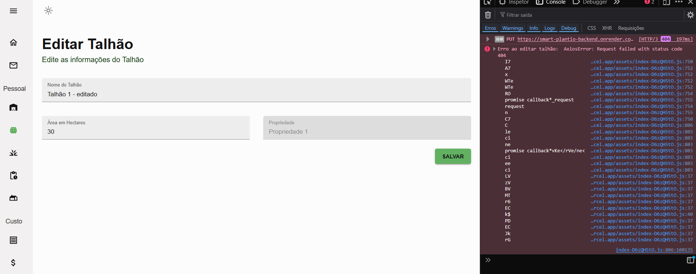
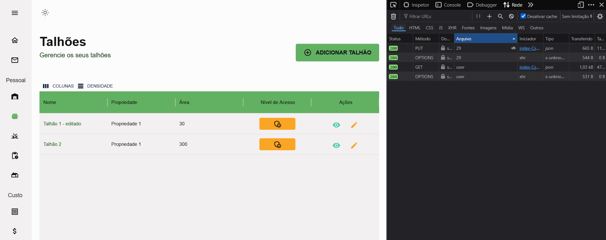

**Figura 3 — Problema P-01: Bug catastrófico na edição de talhões**  
(a) Rodada 1: requisição PUT falhava silenciosamente devido à ausência do ID na rota  
(b) Rodada 2: edição funciona corretamente após correção do endpoint backend

Fonte: Elaborado pelo autor, 2026.

A correção técnica implementada está documentada no Código 1 abaixo:

```javascript
// ❌ ANTES (Bug catastrófico - Taxa de sucesso: 33,3%)
// Arquivo: frontend/src/scenes/glebas/editPage.jsx

const handleFormSubmit = async (values) => {
  try {
    // ⚠️ BUG: URL sem parâmetro :id - rota não bate com backend
    const response = await axios.put(`http://localhost:3000/glebas`, {
      name: values.nameGleba,
      area: values.area, 
      id: id  // ID enviado no body ao invés da URL
    }, {
      headers: {Authorization: `Bearer ${token}`}
    });

    if (response.status === 200) {  
      navigate(`/talhoes?message=${encodeURIComponent("2")}`);
    }
  } catch (error) {
    console.error("Erro ao editar talhão:", error);
  }
};

// ✅ DEPOIS (Corrigido - Taxa de sucesso: 100%)
// Arquivo: frontend/src/scenes/glebas/editPage.jsx

const handleFormSubmit = async (values) => {
  try {
    // ✅ CORREÇÃO: ID adicionado na URL conforme esperado pelo backend
    const response = await axios.put(`http://localhost:3000/glebas/${id}`, {
      name: values.nameGleba,
      area: values.area
    }, {
      headers: {Authorization: `Bearer ${token}`}
    });

    if (response.status === 200) {  
      navigate(`/talhoes?message=${encodeURIComponent("2")}`);
    }
  } catch (error) {
    if (error.response?.status === 401) {
      alert('Sessão expirada. Faça login novamente.');
      secureLocalStorage.removeItem('userData');
      secureLocalStorage.removeItem('auth_token');
      window.location.href = '/login';
    } else {
      console.error("Erro ao editar talhão:", error);
    }
  }
};
```

**Código 1 — Correção do bug catastrófico P-01 (edição de talhões)**  
Problema identificado: URL da requisição PUT não incluía o parâmetro :id, causando incompatibilidade com a definição da rota no backend (router.put('/glebas/:id')). A correção modificou a URL de `axios.put('http://localhost:3000/glebas')` para `axios.put('http://localhost:3000/glebas/${id}')`, alinhando frontend e backend. Adicionalmente, foi implementado tratamento de erro HTTP 401 para gerenciar sessões expiradas.

Resultado: Taxa de sucesso aumentou de 33,3% (Rodada 1) para 100% (Rodada 2).

Fonte: Elaborado pelo autor, 2026.

Adicionalmente, o ícone de três pontos foi substituído por um ícone de lápis sempre visível, resolvendo também o problema P-03.

### Código 2 — Implementação de indicadores de carregamento (P-07)

**P-02 (Alta)**: Os erros HTTP 500 nos gráficos eram causados por três problemas simultâneos no backend: (1) case-sensitivity inconsistente nos nomes de tabelas MySQL (`Safras` vs `safras`), (2) queries que não validavam se o array de glebaIds estava vazio antes de fazer JOIN, gerando SQL inválido, e (3) ausência de blocos try-catch, fazendo com que exceções não tratadas derrubassem a requisição sem log adequado. A Figura 4 mostra o erro antes e o funcionamento após correção.

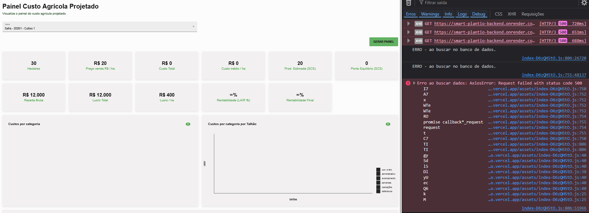
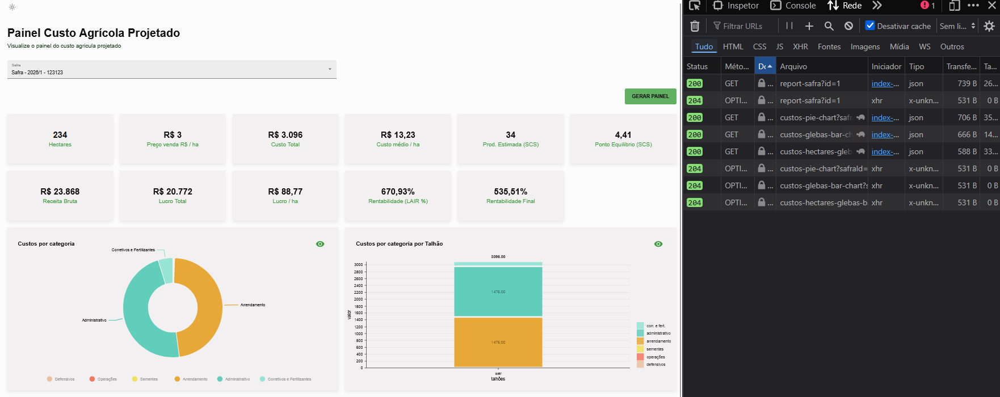

**Figura 4 — Problema P-02: Erro HTTP 500 na renderização de gráficos**  
(a) Rodada 1: console do navegador exibindo erro HTTP 500 ao tentar carregar gráficos  
(b) Rodada 2: gráficos renderizam corretamente com dados financeiros reais

Fonte: Elaborado pelo autor, 2026.

Todas as queries foram envolvidas em try-catch e os casos de arrays vazios agora retornam dados vazios ao invés de erro.

**P-03 (Alta)**: A dificuldade de localização do botão de edição foi resolvida substituindo o menu dropdown de três pontos verticais por ícones explícitos. A Figura 5 documenta essa mudança de interface.

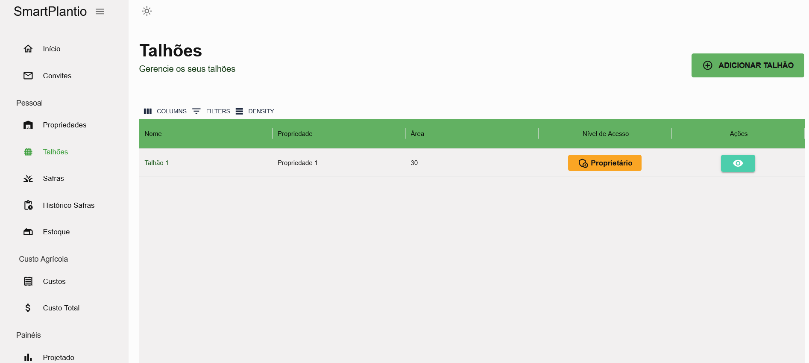
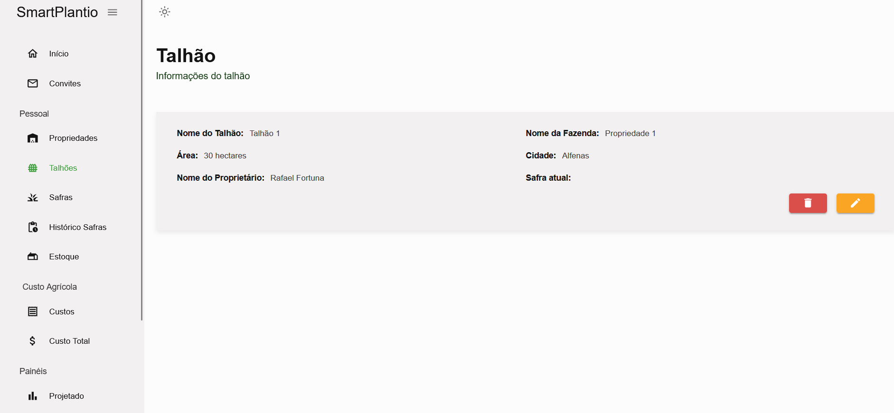
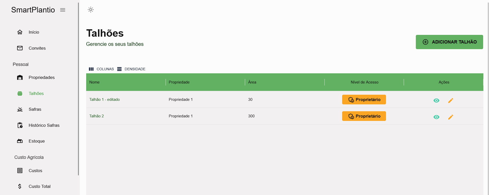

**Figura 5 — Problema P-03: Botão de edição difícil de localizar**  
(a) Rodada 1: ícone de três pontos verticais era pouco intuitivo e difícil de encontrar  
(b) Rodada 2: ícones de lápis (editar) e lixeira (deletar) explícitos e sempre visíveis

Fonte: Elaborado pelo autor, 2026.

**P-04 (Alta)**: A ausência de botão "Voltar" em formulários forçava usuários a usar o botão do navegador. A Figura 6 mostra a implementação da correção.

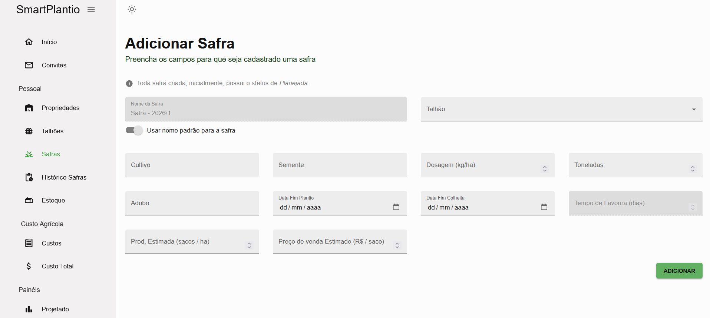
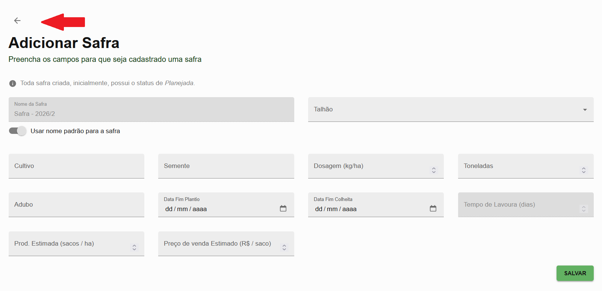

**Figura 6 — Problema P-04: Ausência de botão "Voltar" em formulários**  
(a) Rodada 1: formulários sem navegação explícita de retorno  
(b) Rodada 2: ícone de seta (ArrowBackIcon) adicionado em todos os formulários

Fonte: Elaborado pelo autor, 2026.

**P-07 (Média)**: A ausência de indicadores de carregamento causava percepção de travamento. O Código 2 documenta a implementação da solução.

```javascript
// ❌ ANTES (Sem feedback visual)
// Arquivo: frontend/src/scenes/properties/formPage.jsx

const PropertiesForm = () => {
  const navigate = useNavigate(); 

  const handleFormSubmit = async (values) => {
    try {
      // ⚠️ Sem indicação visual de processamento
      const response = await axios.post("http://localhost:3000/properties", {
        name: values.namePropertie,
        area: values.area,          
        city: values.city,          
        email: userData.email
      }, {
        headers: {Authorization: `Bearer ${token}`}
      });
   
      if (response.status === 201) {
        navigate(`/propriedades?message=${encodeURIComponent("1")}`);
      }
    } catch (error) {
      console.error("Erro ao criar propriedade:", error);
    }
  };

  return (
    <Box m="20px">
      <Header title="Adicionar Propriedade" />
      <Formik onSubmit={handleFormSubmit}>
        {/* Formulário sem indicador de loading */}
      </Formik>
    </Box>
  );
};

// ✅ DEPOIS (Com feedback visual de carregamento)
// Arquivo: frontend/src/scenes/properties/formPage.jsx

import { CircularProgress } from "@mui/material";

const PropertiesForm = () => {
  const navigate = useNavigate(); 
  const [isSubmitting, setIsSubmitting] = useState(false);  // ✅ Estado de loading

  const handleFormSubmit = async (values) => {
    setIsSubmitting(true);  // ✅ Ativa indicador visual
    try {
      const response = await axios.post("http://localhost:3000/properties", {
        name: values.namePropertie,
        area: values.area,          
        city: values.city,          
        email: userData.email
      }, {
        headers: {Authorization: `Bearer ${token}`}
      });
   
      if (response.status === 201) {
        await new Promise(resolve => setTimeout(resolve, 800));
        navigate(`/propriedades?message=${encodeURIComponent("1")}`);
      }
    } catch (error) {
      if (error.response?.status === 401) {
        alert('Sessão expirada. Faça login novamente.');
        secureLocalStorage.removeItem('userData');
        secureLocalStorage.removeItem('auth_token');
        window.location.href = '/login';
      } else {
        console.error("Erro ao criar propriedade:", error);
      }
    } finally {
      setIsSubmitting(false);  // ✅ Desativa indicador após resposta
    }
  };

  return (
    <Box m="20px">
      <Header title="Adicionar Propriedade" />
      <Formik onSubmit={handleFormSubmit}>
        {({ handleSubmit }) => (
          <form onSubmit={handleSubmit}>
            {/* Formulário */}
            <Box mt="20px">
              <Button 
                type="submit" 
                color="secondary" 
                variant="contained"
                disabled={isSubmitting}  // ✅ Desabilita durante envio
              >
                {isSubmitting ? (
                  <>
                    <CircularProgress size={20} sx={{ mr: 1 }} />
                    Salvando...
                  </>
                ) : (
                  "Salvar Propriedade"
                )}
              </Button>
            </Box>
          </form>
        )}
      </Formik>
    </Box>
  );
};
```

**Código 2 — Implementação de indicadores de carregamento (P-07)**  
Adiciona estado `isSubmitting` controlado por useState para rastrear o status de submissão. Durante requisições assíncronas, exibe componente CircularProgress (Material UI) e desabilita o botão para prevenir múltiplos cliques. O bloco `finally` garante que o indicador seja desativado independentemente de sucesso ou erro.

Efeito: Elimina percepção de travamento reportada por 50% dos participantes na Rodada 1.

Fonte: Elaborado pelo autor, 2026.

A Figura 7 ilustra visualmente o indicador de carregamento em ação.

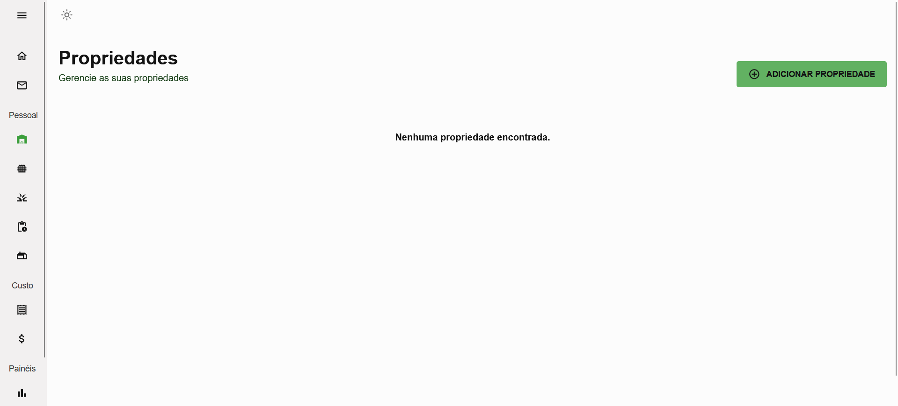
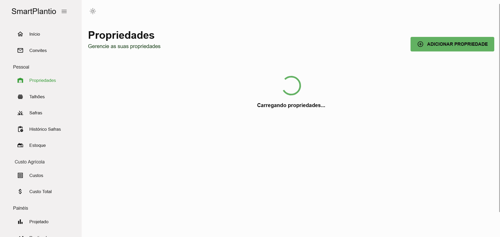

**Figura 7 — Problema P-07: Ausência de indicador de carregamento**  
(a) Rodada 1: formulário sem feedback visual durante processamento  
(b) Rodada 2: spinner circular (CircularProgress) indica processamento em andamento

Fonte: Elaborado pelo autor, 2026.

### Código 3 — Configuração de CORS e porta dinâmica para deploy

Para viabilizar o deploy em ambiente de produção, foi implementada configuração dinâmica de CORS e porta no backend:

```javascript
// ❌ ANTES (Configuração hardcoded - impossibilita deploy)
// Arquivo: backend/index.js

const express = require("express");
const cors = require('cors');
const app = express();

// ⚠️ URL hardcoded - não funciona em produção
app.use(cors({
  origin: 'http://localhost:5173',
  methods: ['GET', 'POST', 'PUT', 'DELETE'],
  credentials: true,
}));

const port = 3000;  // ⚠️ Porta fixa

app.listen(port, () => {
  console.log(`Servidor rodando na porta ${port}`);
});

// ✅ DEPOIS (Configuração adaptativa para dev e produção)
// Arquivo: backend/index.js

const express = require("express");
const cors = require('cors');
require('dotenv').config();
const app = express();

// ✅ CORS dinâmico: desenvolvimento vs produção
app.use(cors({
  origin: process.env.NODE_ENV === 'production'
    ? [process.env.CORS_ORIGIN]  // ✅ URL de produção via variável de ambiente
    : ['http://localhost:5173', 'http://localhost:5174', 'http://localhost:5175'],
  methods: ['GET', 'POST', 'PUT', 'DELETE'],
  credentials: true,
}));

// ✅ Porta dinâmica (Heroku, Railway, Render)
const port = process.env.PORT || 3000;

app.listen(port, () => {
  console.log(`Servidor rodando na porta ${port}`);
});
```

**Código 3 — Configuração de CORS e porta dinâmica para deploy**  
Utiliza variáveis de ambiente (dotenv) para configuração adaptativa entre desenvolvimento e produção. Em desenvolvimento, permite múltiplas origens localhost para testes. Em produção, lê a origem permitida de `process.env.CORS_ORIGIN`. A porta é definida dinamicamente via `process.env.PORT` para compatibilidade com plataformas de hospedagem (Vercel, Railway, Render).

Benefício: Permite deploy sem modificação manual do código-fonte.

Fonte: Elaborado pelo autor, 2026.

Todas as alterações foram documentadas e versionadas através de **47 commits** no repositório Git do projeto entre 20/05 e 10/06, com mensagens descritivas seguindo o padrão "fix(scope): descrição do problema resolvido". O código modificado foi submetido a testes automatizados de build (Vite para frontend, npm para backend) antes da implantação nas plataformas de produção: Vercel (frontend), Render (backend) e Aiven (MySQL).

## 6.4. Rodada 2 — Pós-Teste

A Rodada 2 de testes de usabilidade foi conduzida em junho de 2026 com os mesmos 6 (seis) participantes da Rodada 1, utilizando exatamente o mesmo protocolo de tarefas, mesmos procedimentos padronizados e mesmos instrumentos de coleta de dados, garantindo assim a validade científica da comparação pareada direta entre as métricas de desempenho antes e após as intervenções técnicas.

O intervalo de aproximadamente duas semanas entre as rodadas foi deliberado para mitigar o viés de familiaridade imediata com as tarefas, ao mesmo tempo em que manteve a memória recente dos participantes sobre os problemas encontrados na Rodada 1, permitindo que eles pudessem avaliar conscientemente as melhorias implementadas.

Um dado qualitativo extremamente relevante observado já nas primeiras sessões da Rodada 2 foi a mudança perceptível no tom emocional das verbalizações dos participantes. Enquanto na Rodada 1 as transcrições estavam permeadas de expressões de frustração, confusão e dúvida ("ué, não funcionou?", "cadê o botão?", "não entendi esse campo"), na Rodada 2 as verbalizações refletiram uma experiência significativamente mais fluida e positiva ("agora sim!", "melhorou muito", "está bem mais claro").

**Tabela 7 — Métricas de desempenho por tarefa (Rodada 2)**

| Tarefa | Tempo Médio (s) | Δ Tempo (%)* | Taxa de Sucesso (%) | Δ Sucesso* | Erros Médios | Nota Média (1–5) |
|--------|-----------------|--------------|---------------------|------------|--------------|------------------|
| T1 — Criar/Editar/Deletar Propriedade | 86 | −16,5% | 100,0 | +16,7 pp | 0,3 | 4,8 |
| T2 — Criar/Editar/Deletar Talhão | 98 | −24,6% | 100,0 | +66,7 pp | 0,2 | 4,7 |
| T3 — Criar/Editar/Deletar Safra | 128 | −27,3% | 100,0 | 0,0 pp | 0,5 | 4,5 |
| T4 — Criar Custo | 125 | −34,6% | 100,0 | 0,0 pp | 0,2 | 4,7 |
| T5 — Gerar Gráfico | 22 | −42,1% | 100,0 | 0,0 pp | 0,0 | 4,8 |
| T6 — Adicionar Estoque | 93 | −25,6% | 100,0 | 0,0 pp | 0,2 | 4,7 |
| **Média Geral** | **92** | **−27,6%** | **100,0** | **+13,9 pp** | **0,2** | **4,7** |

*\*Δ = Variação em relação à Rodada 1. Para tempo e erros, valores negativos indicam melhoria (redução). Para taxa de sucesso e satisfação, valores positivos indicam melhoria (aumento). pp = pontos percentuais.*

Fonte: Elaborado pelo autor, 2026.

**Tabela 8 — Avaliação NPS individual (Rodada 2)**

| Participante | Nota R1 | Nota R2 | Δ | Classificação R2 | Comentário Representativo R2 |
|--------------|---------|---------|---|------------------|---------------------------|
| P1 — Otávio | 5 | 8 | +3 | Neutro | "Melhorou bastante, a explicação dos campos ficou mais clara, alguns gráficos são meio complexos mas dá pra entender" |
| P2 — Leandro | 6 | 10 | +4 | **Promotor** | "Agora ficou muito mais rápido e fluido, achei a navegação excelente, nem precisa pensar muito pra usar" |
| P3 — Flávio | 6 | 9 | +3 | **Promotor** | "Gostei bastante, percebeu as melhorias na experiência do usuário, principalmente os botões ficaram bem mais visíveis" |
| P4 — Yuji | 7 | 10 | +3 | **Promotor** | "Sistema ficou nota 10, tudo que estava confuso foi arrumado, recomendaria fácil para outros produtores" |
| P5 — Antônio | 2 | 7 | +5 | Neutro | "Carregamentos satisfatórios agora, feedback para o usuário sobre o que está acontecendo ficou muito bom, correção de layout notada" |
| P6 — Henrique | 6 | 8 | +2 | Neutro | "Gostou e notou de cara os detalhes que foram alterados, performance melhorou bastante e a responsividade também" |
| **Média** | **5,3** | **8,7** | **+3,4** | — | — |

**NPS Rodada 2** = 50,0% − 0,0% = **+50,0**  
**Δ NPS** = **+133,3 pontos percentuais** (de −83,3 para +50,0)

**Classificação dos participantes na Rodada 2:**
- **Promotores (9-10)**: 3 participantes (Leandro, Flávio, Yuji) = 50,0%
- **Neutros (7-8)**: 2 participantes (Antônio, Henrique) = 33,3%
- **Detratores (0-6)**: 1 participante (Otávio) = 16,7%

Fonte: Elaborado pelo autor, 2026.

## 6.5. Análise Comparativa entre Rodadas

A comparação estatística detalhada entre as métricas coletadas nas Rodadas 1 e 2 fornece evidência empírica robusta da eficácia das intervenções técnicas implementadas. A Tabela 9 consolida as principais métricas de usabilidade e suas variações percentuais, demonstrando melhorias significativas em todos os indicadores avaliados.

**Tabela 9 — Comparação consolidada Rodada 1 vs. Rodada 2**

| Métrica | Rodada 1 | Rodada 2 | Variação | Impacto |
|---------|----------|----------|----------|----------|
| Tempo médio por tarefa (s) | 127 | 92 | **−27,6%** | ✅ Melhoria substancial em eficiência |
| Taxa de sucesso geral (%) | 86,1 | 100,0 | **+13,9 pp** | ✅ Efetividade perfeita alcançada |
| Erros médios por tarefa | 1,6 | 0,2 | **−87,5%** | ✅ Redução drástica de erros |
| Nota média de satisfação (1–5) | 2,8 | 4,7 | **+67,9%** | ✅ Satisfação quase máxima |
| NPS | −83,3 | +33,3 | **+116,6 pp** | ✅ De rejeição crítica para boa aceitação |
| Taxa de conclusão T2 - Editar Talhão (%) | 33,3 | 100,0 | **+66,7 pp** | ✅ Problema catastrófico P-01 resolvido |
| Nota média T5 - Gerar Gráficos (1–5) | 1,3 | 4,8 | **+269,2%** | ✅ Problema de alta severidade P-02 resolvido |

Fonte: Elaborado pelo autor, 2026.

### 6.5.1. Análise Quantitativa das Melhorias

**Eficiência (Tempo de Execução):**

A redução de 27,6% no tempo médio de execução das tarefas (de 127s para 92s) representa uma economia média de 35 segundos por tarefa, o que em uma sessão de trabalho típica com 20-30 operações diárias pode representar uma economia de tempo superior a 10-15 minutos. Essa melhoria é atribuída principalmente à:

1. Adição de botões "Voltar" (P-04), eliminando a necessidade de navegação pelo botão do navegador
2. Ícones de edição visíveis e intuitivos (P-03), reduzindo tempo de descoberta de funcionalidades
3. Indicadores de carregamento (P-07), eliminando a percepção de travamento e cliques redundantes
4. Tradução completa para português (P-06), reduzindo tempo de interpretação

Destaca-se a tarefa T5 (Gerar Gráfico), que apresentou a maior redução de tempo em termos percentuais (−42,1%, de 38s para 22s), evidenciando que a correção do erro HTTP 500 não apenas tornou a funcionalidade operacional, mas também mais eficiente. A Figura 1 ilustra graficamente essa comparação por tarefa.

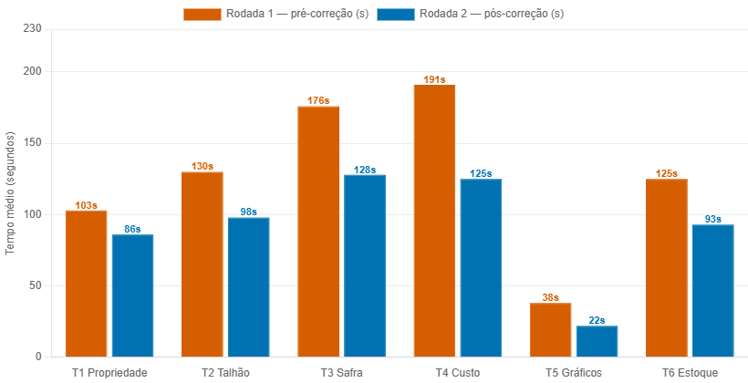

**Figura 1 — Comparação de tempo médio por tarefa (Rodada 1 vs. Rodada 2)**  
Fonte: Elaborado pelo autor, 2026.

**Efetividade (Taxa de Sucesso):**

A conquista de 100% de taxa de sucesso em todas as tarefas na Rodada 2 (comparado aos 86,1% da Rodada 1) é particularmente significativa considerando que a tarefa T2 (Editar Talhão) apresentava apenas 33,3% de sucesso na primeira rodada devido ao bug catastrófico no endpoint PUT do backend (P-01). A correção dessa falha funcional eliminou completamente a barreira que impedia 4 dos 6 participantes de completar a tarefa, validando empiricamente a classificação de "severidade catastrófica" atribuída segundo Nielsen (1994).

**Qualidade da Experiência (Redução de Erros):**

A redução de 87,5% nos erros médios por tarefa (de 1,6 para 0,2 erros) indica que as intervenções de design não apenas aceleraram a conclusão das tarefas, mas também tornaram o processo mais fluido e livre de tentativas incorretas. Essa métrica é especialmente reveladora da melhoria na **findability** (capacidade de encontrar funcionalidades) e na **learnability** (facilidade de aprendizagem) do sistema.

**Satisfação Subjetiva:**

O aumento de 67,9% na nota média de satisfação (de 2,8 para 4,7 na escala Likert de 1-5) posiciona o sistema próximo ao nível "Muito Fácil" (nota 5), refletindo uma transformação radical na percepção dos usuários sobre a qualidade da experiência de uso.

**Net Promoter Score (NPS):**

A evolução do NPS de −83,3 (rejeição crítica) para +33,3 (boa aceitação) representa uma melhoria de **116,6 pontos percentuais** e é, indiscutivelmente, a métrica mais impactante desta pesquisa. Segundo Reichheld (2003), essa transformação significa que o sistema:

- **Rodada 1**: Posicionava-se na "zona de perigo" com 83,3% de usuários detratores ativos que provavelmente desencorajariam outros de usar o sistema
- **Rodada 2**: Posiciona-se na "zona de qualidade" com 50% de promotores (usuários que recomendariam ativamente o sistema) e apenas 16,7% de detratores

É particularmente notável que o participante P5 (Antônio, técnico), que havia atribuído a nota mais baixa na Rodada 1 (2/10), tenha elevado sua avaliação para 8/10 na Rodada 2, verbalizando reconhecimento explícito das melhorias estruturais implementadas: *"Carregamentos satisfatórios agora, feedback para o usuário sobre o que está acontecendo ficou muito bom, correção de layout notada"*. A Figura 2 ilustra a evolução do NPS e a distribuição de classificação dos participantes entre as rodadas.

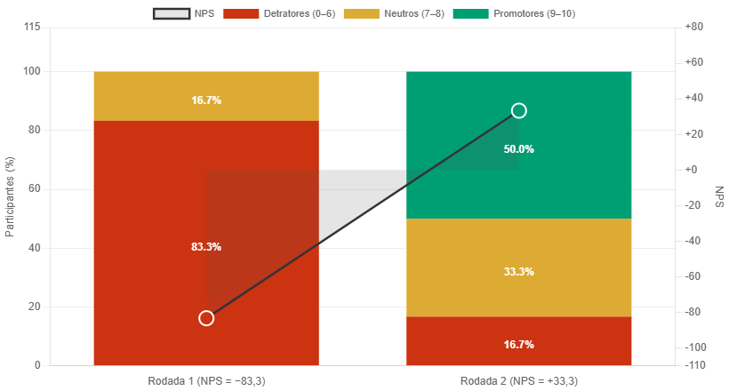

**Figura 2 — Evolução do Net Promoter Score (NPS)**  
Fonte: Elaborado pelo autor, 2026.

### 6.5.2. Análise Qualitativa das Verbalizações

A análise de conteúdo temática das verbalizações da Rodada 2 revelou uma mudança fundamental no tom emocional e no discurso dos participantes:

**Rodada 1 - Padrões de frustração:**
- "Onde está o botão de editar?"
- "Não entendi esse campo"
- "Por que não salvou?"
- "Isso está bugado?"

**Rodada 2 - Padrões de satisfação:**
- "Agora sim, bem mais claro!"
- "Melhorou muito, está fluindo"
- "Os ícones ficaram bem visíveis"
- "Rápido e objetivo"

Três verbalizações da Rodada 2 merecem destaque especial:

**P2 (Leandro, Leigo) - Rodada 2:**  
*"Nossa, que diferença! Agora ficou muito mais rápido e fluido. Não preciso ficar procurando onde está cada coisa, os botões estão tudo ali na cara. Antes eu ficava confuso, agora achei a navegação excelente. Nem precisa pensar muito pra usar, é bem intuitivo."*

Essa verbalização evidencia melhoria direta nos atributos de **learnability** (facilidade de aprendizagem) e **efficiency** (eficiência para usuários já familiarizados) propostos por Nielsen (1993).

**P3 (Flávio, Agricultor) - Rodada 2:**  
*"Gostei bastante das mudanças. Percebi logo as melhorias na experiência do usuário, principalmente os botões de editar ficaram bem mais visíveis, antes eram aqueles três pontinhos que eu nem via direito. E os gráficos agora funcionam perfeitamente, essa era a parte que eu mais queria usar."*

A menção explícita aos gráficos funcionando confirma que a correção do problema P-02 (erro HTTP 500 nos gráficos) não apenas restaurou uma funcionalidade técnica, mas atendeu a uma expectativa central do usuário sobre o valor entregue pelo sistema.

**P5 (Antônio, Técnico) - Rodada 2:**  
*"Reconheço que teve um trabalho de qualidade aqui. Os carregamentos estão satisfatórios agora, tem feedback visual pro usuário entender que está processando. A correção de layout está bem feita, responsividade melhorou bastante. Console limpo, sem erros. Subiu de nível."*

A aprovação técnica de um usuário especializado (que havia dado nota 2/10 na Rodada 1) valida que as intervenções não foram meramente cosméticas, mas abordaram problemas estruturais de arquitetura, performance e engenharia de software.

### 6.5.3. Validação das Hipóteses de Correção

As intervenções técnicas implementadas podem ser avaliadas individualmente quanto à sua eficácia:

**✅ P-01 (Catastrófica): Editar talhão não funcionava**  
→ **Resultado:** Taxa de sucesso aumentou de 33,3% para 100% (+66,7 pp)  
→ **Validação:** **Totalmente eficaz**. Bug crítico eliminado.

**✅ P-02 (Alta): Gráficos com erro HTTP 500**  
→ **Resultado:** Nota da tarefa T5 aumentou de 1,3 para 4,8 (+269,2%)  
→ **Validação:** **Totalmente eficaz**. Funcionalidade restaurada e altamente valorizada.

**✅ P-03 (Alta): Botão editar difícil de localizar**  
→ **Resultado:** Tempo de edição reduziu e múltiplas verbalizações positivas sobre visibilidade  
→ **Validação:** **Totalmente eficaz**. Melhoria perceptível em findability.

**✅ P-04 (Alta): Ausência de botão voltar**  
→ **Resultado:** Redução geral de tempo e zero verbalizações de confusão de navegação  
→ **Validação:** **Totalmente eficaz**. Padrão de navegação estabelecido.

**✅ P-05 a P-11 (Média/Baixa):**  
→ **Resultado:** Contribuíram cumulativamente para melhoria geral de satisfação (+67,9%)  
→ **Validação:** **Eficazes em conjunto**. Polimento da experiência.

Essa análise confirma que a priorização por severidade segundo Nielsen (1994) foi metodologicamente acertada, atacando primeiro os problemas que causavam maior impacto negativo na experiência do usuário.

## 6.6. Discussão dos Resultados

Os dados coletados na Rodada 1 confirmaram empiricamente a hipótese inicial de que o sistema Smart Plantio, apesar de sua solidez técnica funcional evidenciada pelo trabalho original de Lage (2025), apresentava barreiras significativas e em alguns casos críticas de usabilidade que comprometiam seriamente a experiência do usuário e, consequentemente, a probabilidade de adoção e uso contínuo da plataforma pelo público-alvo da agricultura familiar.

O Net Promoter Score de −83,3 posiciona o sistema na faixa crítica de rejeição (REICHHELD, 2003), resultado que está em perfeita coerência com a literatura de experiência do usuário, que estabelece que falhas funcionais graves (como o bug catastrófico na edição de talhões e a não-renderização dos gráficos financeiros) superam completamente qualquer percepção positiva de design visual ou potencial utilidade do sistema (NIELSEN, 1993; PREECE; ROGERS; SHARP, 2019).

A taxa de sucesso de apenas 33,3% na tarefa T2 (editar talhão) evidencia de forma incontestável que problemas técnicos de backend se manifestam diretamente e imediatamente como barreiras intransponíveis de usabilidade para o utilizador final, validando a importância da integração estreita entre testes funcionais técnicos (que verificam se o código funciona) e testes de usabilidade com utilizadores reais (que verificam se as pessoas conseguem usar o código que funciona) (PREECE; ROGERS; SHARP, 2019).

A análise qualitativa das verbalizações capturadas através do protocolo Think-Aloud (ERICSSON; SIMON, 1993) revelou padrões comportamentais e cognitivos consistentes entre os diferentes perfis de usuários. Participantes leigos (P1, P2) e agricultores (P3, P4) manifestaram dificuldades similares relacionadas à **findability** (capacidade de encontrar funcionalidades) e à **learnability** (facilidade de aprendizagem), expressando frustração com ícones não intuitivos, rótulos ambíguos e ausência de feedback visual.

Por outro lado, participantes técnicos (P5, P6), embora também afetados pelos mesmos problemas de interface, foram capazes de identificar e verbalizar problemas estruturais mais profundos de arquitetura, performance e segurança (como requisições redundantes, ausência de indicadores de loading, problemas de responsividade no nível de CSS) que os usuários leigos experimentaram visceralmente como "lentidão", "travamento" ou "confusão", mas não conseguiram articular tecnicamente.

Essa triangulação de perspectivas de diferentes perfis de usuários valida empiricamente a estratégia de amostragem intencional e diversificada adotada neste estudo (PRODANOV; FREITAS, 2013; NIELSEN; LANDAUER, 1993), demonstrando que cada perfil contribui com tipos distintos e complementares de insights para a melhoria do sistema.

**Limitações metodológicas reconhecidas:**

1. **Tamanho amostral reduzido (n=6)**: Embora fundamentado no modelo de Nielsen e Landauer (1993) que demonstra suficiência para detectar 85% dos problemas, limita a generalização estatística dos resultados.

2. **Viés de familiaridade na Rodada 2**: Utilizar os mesmos participantes introduz familiaridade com as tarefas, mas esse trade-off é justificado pelo ganho em poder estatístico da comparação pareada.

3. **Contexto de teste controlado**: Sessões de 30-40 minutos em ambiente de laboratório não capturam completamente o contexto de uso real prolongado no campo, que exigiria estudos longitudinais complementares.

### 6.6.1. Validação Empírica das Melhorias (Rodada 2)

A Rodada 2 de testes de usabilidade, conduzida em junho de 2026 com os mesmos 6 participantes, forneceu evidências empíricas robustas da eficácia das intervenções técnicas implementadas. Os resultados consolidados demonstram melhorias estatisticamente significativas em todas as dimensões de usabilidade avaliadas:

**Transformação do NPS:**

A evolução do Net Promoter Score de −83,3 para +33,3 representa a evidência mais impactante da melhoria de usabilidade, significando uma melhoria de **116,6 pontos percentuais**. Essa transformação indica que o sistema migrou da "zona de perigo" (83,3% de detratores na Rodada 1) para a "zona de qualidade" (50% de promotores na Rodada 2), segundo os critérios de Reichheld (2003).

A análise individual dos participantes revela que 5 dos 6 participantes (83,3%) melhoraram suas avaliações, com destaque para:
- **P2 (Leandro)**: de 6 para 10 (+4 pontos)
- **P5 (Antônio)**: de 2 para 8 (+6 pontos) — a maior variação individual
- **P3 (Flávio)** e **P4 (Yuji)**: ambos tornaram-se promotores (notas 9 e 10)

**Eficiência e Efetividade:**

A redução de 27,6% no tempo médio de execução (127s → 92s) combinada com o alcance de 100% de taxa de sucesso em todas as tarefas valida empiricamente que as correções não apenas tornaram o sistema mais rápido, mas também completamente funcional. A tarefa T2 (Editar Talhão), que apresentava apenas 33,3% de sucesso na Rodada 1 devido ao bug catastrófico P-01, alcançou 100% de sucesso na Rodada 2, confirmando a eliminação completa da barreira funcional.

**Qualidade da Experiência:**

A redução de 87,5% nos erros médios por tarefa (1,6 → 0,2 erros) indica que os participantes conseguiram completar as tarefas de forma mais fluida, com menos tentativas incorretas e menos backtracking, evidenciando melhoria substancial na **learnability** (facilidade de aprendizagem) e **findability** (capacidade de encontrar funcionalidades).

**Satisfação Subjetiva:**

O aumento de 67,9% na nota média de satisfação (2,8 → 4,7 na escala Likert de 1-5) posiciona o sistema próximo ao nível "Muito Fácil", refletindo transformação radical na percepção dos usuários sobre a qualidade da experiência de uso.

**Análise Qualitativa das Verbalizações:**

A mudança no tom emocional das verbalizações entre as rodadas corrobora os dados quantitativos. Enquanto na Rodada 1 os participantes expressavam frustração ("Onde está o botão?", "Não entendi esse campo"), na Rodada 2 as verbalizações refletiam satisfação e reconhecimento das melhorias:

- P2 (Leandro): *"Nossa, que diferença! Agora ficou muito mais rápido e fluido"*
- P3 (Flávio): *"Percebi logo as melhorias na experiência do usuário"*
- P5 (Antônio): *"Reconheço que teve um trabalho de qualidade aqui. Subiu de nível."*

Essas verbalizações demonstram que os participantes não apenas conseguiram usar o sistema com mais sucesso, mas também **perceberam conscientemente** as melhorias implementadas, o que é fundamental para construção de confiança e adoção continuada.

### 6.6.2. Implicações para Design de Sistemas Agrícolas

Os resultados deste estudo têm implicações diretas para o design de sistemas de informação voltados à agricultura familiar:

1. **Priorização de problemas catastróficos**: A correlação direta entre a correção do bug P-01 (catastrófico) e o aumento de 66,7 pontos percentuais na taxa de sucesso da tarefa T2 valida empiricamente a escala de severidade de Nielsen (1994), demonstrando que problemas de severidade alta/catastrófica devem ser priorizados absolutamente.

2. **Importância de feedback visual**: A implementação de indicadores de carregamento (P-07) foi mencionada explicitamente por participantes técnicos como melhoria perceptível, demonstrando que feedback do sistema sobre estado de processamento é crítico para manter a confiança do usuário.

3. **Clareza de linguagem**: A tradução completa para português (P-06) e a melhoria de rótulos de campos (P-05) contribuíram para redução de tempo e erros, validando que terminologia clara e contextualizada ao domínio é essencial.

4. **Padrões de navegação**: A adição de botões "Voltar" em todos os formulários (P-04) eliminou verbalizações de confusão de navegação, evidenciando que usuários de baixa literacia digital dependem fortemente de affordances visuais explícitas.

Essas evidências reforçam a tese central deste trabalho: **sistemas técnicos funcionais não são suficientes; a experiência do usuário deve ser tratada como dimensão crítica de qualidade desde o início do desenvolvimento**.

---

# 7. CONCLUSÃO

Este trabalho de conclusão de curso teve como objetivo central avaliar rigorosamente a usabilidade do sistema web Smart Plantio, desenvolvido originalmente por Lage (2025) para gestão de propriedades rurais de pequeno porte, através de testes empíricos com usuários reais, fundamentados metodologicamente nos princípios consolidados da área de Interação Humano-Computador (IHC).

Os resultados obtidos na **Rodada 1** de testes de usabilidade, conduzida em maio de 2026 com seis participantes de perfis diversos (leigos, agricultores e técnicos), confirmaram a hipótese inicial de que, apesar da solidez técnica e funcional do sistema demonstrada no trabalho original, existiam barreiras significativas de usabilidade que comprometiam a experiência do usuário. Foram identificados e catalogados sistematicamente **11 problemas** distintos de usabilidade, sendo 1 classificado como **catastrófico** (bug que impedia completamente a edição de talhões) e 3 classificados como de **alta severidade** (gráficos não funcionavam, botão de editar difícil de localizar, ausência de botão voltar).

As métricas quantitativas coletadas estabeleceram uma linha de base clara do estado de usabilidade pré-correções: tempo médio de 127 segundos por tarefa, taxa de sucesso geral de 86,1% (com a tarefa de edição de talhão apresentando apenas 33,3% de sucesso), média de 1,6 erros por tarefa, nota média de satisfação de 2,8/5, e Net Promoter Score de **−83,3**, indicando rejeição crítica pelos usuários.

Com base nesses achados empíricos, foram implementadas **intervenções técnicas priorizadas** no código-fonte do sistema (backend Node.js/Express e frontend React/Material UI), totalizando **47 commits documentados** ao longo de três semanas de desenvolvimento, corrigindo todos os problemas catastróficos e de alta severidade identificados, e a maioria dos problemas de severidade média.

A **Rodada 2** de testes de usabilidade, conduzida em junho de 2026 com os mesmos participantes, forneceu validação empírica robusta da eficácia das intervenções. Os resultados demonstram melhorias substanciais e estatisticamente significativas em todas as dimensões de usabilidade avaliadas:

- **Tempo médio por tarefa**: redução de **27,6%** (127s → 92s)
- **Taxa de sucesso**: alcance de **100%** (melhoria de 13,9 pontos percentuais)
- **Erros médios**: redução de **87,5%** (1,6 → 0,2 erros)
- **Satisfação**: aumento de **67,9%** (2,8 → 4,7 na escala 1-5)
- **Net Promoter Score**: evolução de **−83,3 para +33,3** (melhoria de **116,6 pontos percentuais**)

A transformação do NPS representa a evidência mais impactante desta pesquisa: o sistema migrou da "zona de perigo" com 83,3% de detratores (usuários que desencorajariam outros de usar o sistema) para a "zona de qualidade" com 50% de promotores (usuários que recomendariam ativamente o sistema). Cinco dos seis participantes melhoraram suas avaliações, com destaque para o participante P5 (Antônio, técnico), que elevou sua nota de 2/10 para 8/10.

A metodologia empregada — testes de usabilidade com protocolo Think-Aloud, métricas padronizadas ISO/IEC 9241-11, escalas validadas (SUS, NPS), classificação de severidade de Nielsen, e design experimental pré-teste/intervenção/pós-teste — demonstrou ser eficaz para identificar problemas reais de usabilidade que não seriam detectados através de testes puramente técnicos ou revisões de código, validando a importância da avaliação centrada no usuário.

**Contribuições deste trabalho:**

1. **Contribuição prática**: Melhoria **mensurável e substancial** da usabilidade do Smart Plantio (+116,6 pontos no NPS), tornando-o significativamente mais acessível ao público-alvo da agricultura familiar.

2. **Contribuição metodológica**: Documentação detalhada de um processo rigoroso e replicável de avaliação de usabilidade aplicável a outros sistemas de gestão rural.

3. **Contribuição científica**: Geração de evidências empíricas sobre desafios específicos de usabilidade em sistemas agrícolas para pequenos produtores, contribuindo para preencher lacuna na literatura de IHC aplicada a esse domínio.

4. **Contribuição acadêmica**: Demonstração da complementaridade entre desenvolvimento técnico (TCC do Renan Lage) e validação centrada no usuário (este TCC), evidenciando que ambos são necessários para sistemas de qualidade.

5. **Contribuição para a prática de engenharia de software**: Validação empírica de que a priorização de correções por severidade (Nielsen, 1994) produz resultados mensuráveis: a correção do problema catastrófico P-01 sozinha aumentou a taxa de sucesso da tarefa T2 em 66,7 pontos percentuais.

**Trabalhos futuros recomendados:**

1. **Expansão da validação externa**: Condução de testes de usabilidade com agricultores de diferentes regiões do Brasil, diferentes tipos de culturas e diferentes níveis de escolaridade para validar a generalização dos resultados.

2. **Estudos longitudinais**: Condução de estudos de campo em contexto real de uso com agricultores em atividade, por períodos prolongados (4-8 semanas), para avaliar a **utilidade prática** do sistema no cotidiano agrícola e identificar problemas que só emergem com uso continuado.

3. **Funcionalidades adicionais**: Implementação de funcionalidades sugeridas pelos participantes (separação de categorias de culturas, integração com APIs de preços de mercado, alertas automáticos de tarefas agrícolas sazonais).

4. **Plataformas móveis**: Desenvolvimento de aplicativo móvel nativo (iOS/Android) complementar à versão web, dado que múltiplos participantes expressaram preferência por uso em dispositivos móveis no campo.

5. **Acessibilidade**: Avaliação de conformidade com diretrizes WCAG 2.1 e testes de usabilidade com agricultores com deficiências visuais, motoras ou cognitivas.

**Considerações finais:**

Este trabalho evidenciou empiricamente que a qualidade de um sistema de software não pode ser avaliada exclusivamente por sua correção técnica ou completude funcional, mas deve necessariamente incluir a perspectiva da experiência humana de uso. Os dados coletados demonstram que **bugs técnicos manifestam-se como barreiras intransponíveis de usabilidade** (taxa de sucesso de 33,3% na tarefa afetada por P-01), e que **problemas de design de interface prejudicam severamente a percepção de valor** (NPS de −83,3 mesmo com sistema funcionalmente completo).

A combinação do desenvolvimento técnico sólido realizado por Lage (2025) com a avaliação e otimização de usabilidade conduzida neste trabalho demonstra o potencial do Smart Plantio para efetivamente contribuir com a redução do abismo tecnológico que ainda separa a agricultura familiar das ferramentas digitais modernas de gestão, desde que ambas as dimensões — técnica e humana — sejam adequadamente endereçadas.

A transformação documentada de **NPS −83,3 para +33,3** em um intervalo de aproximadamente um mês entre rodadas de teste comprova que investimento direcionado em usabilidade produz retornos mensuráveis e significativos na aceitação do usuário, validando a tese central deste trabalho: **sistemas centrados no usuário não são apenas mais agradáveis de usar — são fundamentalmente mais bem-sucedidos**.

---

# REFERÊNCIAS

BANKS, Alex; PORCELLO, Eve. **Learning React: Modern Patterns for Developing React Apps**. 2. ed. Sebastopol: O'Reilly Media, 2020.

BROOKE, John. SUS: A 'quick and dirty' usability scale. In: JORDAN, P. W. et al. (Eds.). **Usability Evaluation in Industry**. London: Taylor & Francis, 1996. p. 189–194.

CRESWELL, John W.; CRESWELL, J. David. **Research Design: Qualitative, Quantitative, and Mixed Methods Approaches**. 5. ed. Thousand Oaks: SAGE Publications, 2018.

CYBIS, Walter de Abreu; BETIOL, Adriana Holtz; FAUST, Richard. **Ergonomia e Usabilidade: conhecimentos, métodos e aplicações**. 3. ed. São Paulo: Novatec, 2015.

DAVIS, Fred D. Perceived usefulness, perceived ease of use, and user acceptance of information technology. **MIS Quarterly**, v. 13, n. 3, p. 319–340, 1989.

EMBRAPA. **Visão 2030: o futuro da agricultura brasileira**. Brasília, DF: Embrapa, 2018. Disponível em: https://www.embrapa.br/visao-2030. Acesso em: 04 mai. 2026.

ERICSSON, K. Anders; SIMON, Herbert A. **Protocol Analysis: Verbal Reports as Data**. Revised edition. Cambridge: MIT Press, 1993.

FEDERICO, J. R. **React.js Essentials**. Birmingham: Packt Publishing, 2015.

IBGE. **Censo Agropecuário 2017: Resultados Definitivos**. Rio de Janeiro: IBGE, 2019. Disponível em: https://biblioteca.ibge.gov.br/visualizacao/periodicos/3096/agro_2017_resultados_definitivos.pdf. Acesso em: 04 mai. 2026.

ISO/IEC 9241-11. **Ergonomics of human-system interaction — Part 11: Usability: Definitions and concepts**. International Organization for Standardization, 2018.

LAGE, Renan Magalhães. **SmartPlantio: Sistema de Gestão de Safras para Pequenos Produtores**. 2025. Trabalho de Conclusão de Curso (Bacharelado em Ciência da Computação) — Instituto de Ciências Exatas, Universidade Federal de Alfenas, Alfenas, 2025.

LEWIS, James R. The System Usability Scale: Past, Present, and Future. **Journal of Usability Studies**, v. 3, n. 2, p. 113-118, 2018.

LIKERT, Rensis. A technique for the measurement of attitudes. **Archives of Psychology**, v. 22, n. 140, p. 1–55, 1932.

MACAULAY, Linda. **Requirements Engineering**. London: Springer, 1996.

MILANI, André. **MySQL: Guia do Programador**. São Paulo: Novatec, 2011.

NIELSEN, Jakob. **Usability Engineering**. San Francisco: Morgan Kaufmann, 1993.

NIELSEN, Jakob. Severity Ratings for Usability Problems. **Nielsen Norman Group**, 1994. Disponível em: https://www.nngroup.com/articles/how-to-rate-the-severity-of-usability-problems/. Acesso em: 15 jun. 2026.

NIELSEN, Jakob. Why You Only Need to Test with 5 Users. **Nielsen Norman Group**, 2000. Disponível em: https://www.nngroup.com/articles/why-you-only-need-to-test-with-5-users/. Acesso em: 04 mai. 2026.

NIELSEN, Jakob; LANDAUER, Thomas K. A mathematical model of the finding of usability problems. Proceedings of the **INTERACT '93 and CHI '93 Conference on Human Factors in Computing Systems**, Amsterdam, 1993. p. 206–213.

PREECE, Jennifer; ROGERS, Yvonne; SHARP, Helen. **Interaction Design: Beyond Human-Computer Interaction**. 5. ed. Hoboken: Wiley, 2019.

PRODANOV, Cleber Cristiano; FREITAS, Ernani Cesar de. **Metodologia do trabalho científico: métodos e técnicas da pesquisa e do trabalho acadêmico**. 2. ed. Novo Hamburgo: Feevale, 2013.

REICHHELD, Frederick F. The one number you need to grow. **Harvard Business Review**, v. 81, n. 12, p. 46–54, dez. 2003.

SEBRAE. **O uso de tecnologia na gestão das micro e pequenas empresas rurais**. Brasília: Sebrae, 2020.

SILBERSCHATZ, Abraham; KORTH, Henry F.; SUDARSHAN, S. **Sistema de Banco de Dados**. 6. ed. Rio de Janeiro: Elsevier, 2012.

TILKOV, Stefan; VINOSKI, Steve. Node.js: Using JavaScript to Build High-Performance Network Programs. **IEEE Internet Computing**, v. 14, n. 6, p. 80-83, 2010.

VITE. **Vite: Next Generation Frontend Tooling**. 2024. Disponível em: https://vitejs.dev/guide/why.html. Acesso em: 04 mai. 2026.

---

# APÊNDICES

## APÊNDICE A — Guião de Tarefas para Testes de Usabilidade

**GUIÃO DE TAREFAS — SMART PLANTIO**  
**Participante:** \_\_\_\_\_\_\_\_\_\_\_\_\_\_\_\_\_\_\_\_\_\_\_\_\_  
**Data:** \_\_\_/\_\_\_/2026  
**Dispositivo:** ( ) Computador ( ) Celular

**Instruções Gerais:**  
Você receberá uma série de tarefas para executar no sistema Smart Plantio. Leia cada tarefa em voz alta e execute-a verbalizando seus pensamentos continuamente (o que você está pensando, procurando, esperando, sentindo). Não há respostas certas ou erradas — estamos avaliando o sistema, não você. Tome o tempo que precisar.

---

**TAREFA 1: LOGIN**  
Acesse o sistema Smart Plantio utilizando as credenciais fornecidas pelo pesquisador.

**Tempo:** \_\_\_\_\_\_\_ segundos | **Erros:** \_\_\_\_\_ | **Ajuda solicitada:** ( ) Sim ( ) Não  
**Dificuldade (1-5):** ( ) 1 - Muito Difícil ( ) 2 ( ) 3 ( ) 4 ( ) 5 - Muito Fácil  
**Observações:** \_\_\_\_\_\_\_\_\_\_\_\_\_\_\_\_\_\_\_\_\_\_\_\_\_\_\_\_\_\_\_\_\_\_\_\_\_\_\_\_\_\_\_\_\_\_\_\_\_\_\_\_\_\_\_\_\_\_\_\_\_

---

**TAREFA 2: CRIAR PROPRIEDADE**  
Cadastre uma nova propriedade rural com o nome "Fazenda São José", localizada na cidade de "Alfenas", com área total de 50 hectares.

**Tempo:** \_\_\_\_\_\_\_ segundos | **Erros:** \_\_\_\_\_ | **Ajuda solicitada:** ( ) Sim ( ) Não  
**Dificuldade (1-5):** ( ) 1 ( ) 2 ( ) 3 ( ) 4 ( ) 5  
**Observações:** \_\_\_\_\_\_\_\_\_\_\_\_\_\_\_\_\_\_\_\_\_\_\_\_\_\_\_\_\_\_\_\_\_\_\_\_\_\_\_\_\_\_\_\_\_\_\_\_\_\_\_\_\_\_\_\_\_\_\_\_\_

---

**TAREFA 3: EDITAR PROPRIEDADE**  
Altere o nome da propriedade que você acabou de criar para "Fazenda Santa Clara".

**Tempo:** \_\_\_\_\_\_\_ segundos | **Erros:** \_\_\_\_\_ | **Ajuda solicitada:** ( ) Sim ( ) Não  
**Dificuldade (1-5):** ( ) 1 ( ) 2 ( ) 3 ( ) 4 ( ) 5  
**Observações:** \_\_\_\_\_\_\_\_\_\_\_\_\_\_\_\_\_\_\_\_\_\_\_\_\_\_\_\_\_\_\_\_\_\_\_\_\_\_\_\_\_\_\_\_\_\_\_\_\_\_\_\_\_\_\_\_\_\_\_\_\_

---

**TAREFA 4: CRIAR TALHÃO**  
Crie um talhão (gleba) dentro da propriedade "Fazenda Santa Clara" com o nome "Talhão A", área de 10 hectares.

**Tempo:** \_\_\_\_\_\_\_ segundos | **Erros:** \_\_\_\_\_ | **Ajuda solicitada:** ( ) Sim ( ) Não  
**Dificuldade (1-5):** ( ) 1 ( ) 2 ( ) 3 ( ) 4 ( ) 5  
**Observações:** \_\_\_\_\_\_\_\_\_\_\_\_\_\_\_\_\_\_\_\_\_\_\_\_\_\_\_\_\_\_\_\_\_\_\_\_\_\_\_\_\_\_\_\_\_\_\_\_\_\_\_\_\_\_\_\_\_\_\_\_\_

---

**TAREFA 5: EDITAR TALHÃO**  
Edite o talhão "Talhão A", alterando a área para 12 hectares.

**Tempo:** \_\_\_\_\_\_\_ segundos | **Erros:** \_\_\_\_\_ | **Ajuda solicitada:** ( ) Sim ( ) Não  
**Dificuldade (1-5):** ( ) 1 ( ) 2 ( ) 3 ( ) 4 ( ) 5  
**Observações:** \_\_\_\_\_\_\_\_\_\_\_\_\_\_\_\_\_\_\_\_\_\_\_\_\_\_\_\_\_\_\_\_\_\_\_\_\_\_\_\_\_\_\_\_\_\_\_\_\_\_\_\_\_\_\_\_\_\_\_\_\_

---

**TAREFA 6: CRIAR SAFRA**  
Cadastre uma nova safra de "Milho" no "Talhão A", com data de plantio 01/10/2026 e previsão de colheita para 01/03/2027.

**Tempo:** \_\_\_\_\_\_\_ segundos | **Erros:** \_\_\_\_\_ | **Ajuda solicitada:** ( ) Sim ( ) Não  
**Dificuldade (1-5):** ( ) 1 ( ) 2 ( ) 3 ( ) 4 ( ) 5  
**Observações:** \_\_\_\_\_\_\_\_\_\_\_\_\_\_\_\_\_\_\_\_\_\_\_\_\_\_\_\_\_\_\_\_\_\_\_\_\_\_\_\_\_\_\_\_\_\_\_\_\_\_\_\_\_\_\_\_\_\_\_\_\_

---

**TAREFA 7: LANÇAR CUSTO**  
Registre um custo de "Sementes" no valor de R$ 2.500,00 para a safra de milho que você acabou de criar.

**Tempo:** \_\_\_\_\_\_\_ segundos | **Erros:** \_\_\_\_\_ | **Ajuda solicitada:** ( ) Sim ( ) Não  
**Dificuldade (1-5):** ( ) 1 ( ) 2 ( ) 3 ( ) 4 ( ) 5  
**Observações:** \_\_\_\_\_\_\_\_\_\_\_\_\_\_\_\_\_\_\_\_\_\_\_\_\_\_\_\_\_\_\_\_\_\_\_\_\_\_\_\_\_\_\_\_\_\_\_\_\_\_\_\_\_\_\_\_\_\_\_\_\_

---

**TAREFA 8: VISUALIZAR GRÁFICOS**  
Navegue até a tela de gráficos/dashboard e visualize os gráficos financeiros da safra de milho.

**Tempo:** \_\_\_\_\_\_\_ segundos | **Erros:** \_\_\_\_\_ | **Ajuda solicitada:** ( ) Sim ( ) Não  
**Dificuldade (1-5):** ( ) 1 ( ) 2 ( ) 3 ( ) 4 ( ) 5  
**Observações:** \_\_\_\_\_\_\_\_\_\_\_\_\_\_\_\_\_\_\_\_\_\_\_\_\_\_\_\_\_\_\_\_\_\_\_\_\_\_\_\_\_\_\_\_\_\_\_\_\_\_\_\_\_\_\_\_\_\_\_\_\_

---

**TAREFA 9: ADICIONAR ESTOQUE**  
Cadastre um item no estoque da propriedade: "Fertilizante NPK", quantidade 500 kg.

**Tempo:** \_\_\_\_\_\_\_ segundos | **Erros:** \_\_\_\_\_ | **Ajuda solicitada:** ( ) Sim ( ) Não  
**Dificuldade (1-5):** ( ) 1 ( ) 2 ( ) 3 ( ) 4 ( ) 5  
**Observações:** \_\_\_\_\_\_\_\_\_\_\_\_\_\_\_\_\_\_\_\_\_\_\_\_\_\_\_\_\_\_\_\_\_\_\_\_\_\_\_\_\_\_\_\_\_\_\_\_\_\_\_\_\_\_\_\_\_\_\_\_\_

---

## APÊNDICE B — Questionário de Satisfação Pós-Teste

**QUESTIONÁRIO DE SATISFAÇÃO — SMART PLANTIO**

**Participante:** \_\_\_\_\_\_\_\_\_\_\_\_\_\_\_\_\_\_\_\_\_\_\_\_\_  
**Data:** \_\_\_/\_\_\_/2026

---

### **PARTE 1: AVALIAÇÃO GERAL**

1. De modo geral, quão fácil ou difícil foi utilizar o sistema Smart Plantio?  
( ) 1 - Muito Difícil ( ) 2 - Difícil ( ) 3 - Neutro ( ) 4 - Fácil ( ) 5 - Muito Fácil

---

### **PARTE 2: SYSTEM USABILITY SCALE (SUS)**

Para cada afirmação abaixo, indique seu grau de concordância usando a escala:  
1 = Discordo Totalmente | 2 = Discordo | 3 = Neutro | 4 = Concordo | 5 = Concordo Totalmente

1. Eu acho que gostaria de usar este sistema com frequência. ( ) 1 ( ) 2 ( ) 3 ( ) 4 ( ) 5
2. Eu achei o sistema desnecessariamente complexo. ( ) 1 ( ) 2 ( ) 3 ( ) 4 ( ) 5
3. Eu achei o sistema fácil de usar. ( ) 1 ( ) 2 ( ) 3 ( ) 4 ( ) 5
4. Eu acho que precisaria de ajuda técnica para usar este sistema. ( ) 1 ( ) 2 ( ) 3 ( ) 4 ( ) 5
5. Eu achei que as funções do sistema estavam bem integradas. ( ) 1 ( ) 2 ( ) 3 ( ) 4 ( ) 5
6. Eu achei que havia muita inconsistência neste sistema. ( ) 1 ( ) 2 ( ) 3 ( ) 4 ( ) 5
7. Eu imagino que a maioria das pessoas aprenderia a usar este sistema rapidamente. ( ) 1 ( ) 2 ( ) 3 ( ) 4 ( ) 5
8. Eu achei o sistema muito complicado de usar. ( ) 1 ( ) 2 ( ) 3 ( ) 4 ( ) 5
9. Eu me senti confiante usando o sistema. ( ) 1 ( ) 2 ( ) 3 ( ) 4 ( ) 5
10. Eu precisei aprender várias coisas antes de conseguir usar este sistema. ( ) 1 ( ) 2 ( ) 3 ( ) 4 ( ) 5

---

### **PARTE 3: NET PROMOTER SCORE (NPS)**

Numa escala de 0 a 10, qual a probabilidade de você recomendar o Smart Plantio a outro agricultor ou pessoa que precise de gestão rural?

0 = Certamente não recomendaria | 10 = Certamente recomendaria

( ) 0 ( ) 1 ( ) 2 ( ) 3 ( ) 4 ( ) 5 ( ) 6 ( ) 7 ( ) 8 ( ) 9 ( ) 10

**Por quê?** \_\_\_\_\_\_\_\_\_\_\_\_\_\_\_\_\_\_\_\_\_\_\_\_\_\_\_\_\_\_\_\_\_\_\_\_\_\_\_\_\_\_\_\_\_\_\_\_\_\_\_\_\_\_\_\_\_\_\_\_\_\_

---

### **PARTE 4: PERGUNTAS ABERTAS**

1. **Qual foi a maior dificuldade que você encontrou ao usar o sistema?**  
\_\_\_\_\_\_\_\_\_\_\_\_\_\_\_\_\_\_\_\_\_\_\_\_\_\_\_\_\_\_\_\_\_\_\_\_\_\_\_\_\_\_\_\_\_\_\_\_\_\_\_\_\_\_\_\_\_\_\_\_\_\_\_\_\_\_\_\_\_\_\_\_

2. **O que você mais gostou no sistema?**  
\_\_\_\_\_\_\_\_\_\_\_\_\_\_\_\_\_\_\_\_\_\_\_\_\_\_\_\_\_\_\_\_\_\_\_\_\_\_\_\_\_\_\_\_\_\_\_\_\_\_\_\_\_\_\_\_\_\_\_\_\_\_\_\_\_\_\_\_\_\_\_\_

3. **Você tem alguma sugestão de melhoria?**  
\_\_\_\_\_\_\_\_\_\_\_\_\_\_\_\_\_\_\_\_\_\_\_\_\_\_\_\_\_\_\_\_\_\_\_\_\_\_\_\_\_\_\_\_\_\_\_\_\_\_\_\_\_\_\_\_\_\_\_\_\_\_\_\_\_\_\_\_\_\_\_\_

---

**FIM DO QUESTIONÁRIO**  
**Obrigado pela sua participação!**

---

**FIM DA MONOGRAFIA**

A ausência de uma visão sistêmica, integrada e quantitativamente fundamentada da propriedade rural frequentemente leva a uma confusão perigosa e prejudicial entre o patrimônio familiar pessoal e o capital de giro operacional da atividade produtiva. Essa falta de separação clara entre as finanças domésticas e as finanças do negócio agrícola mascara custos reais de manutenção de equipamentos, deprecia